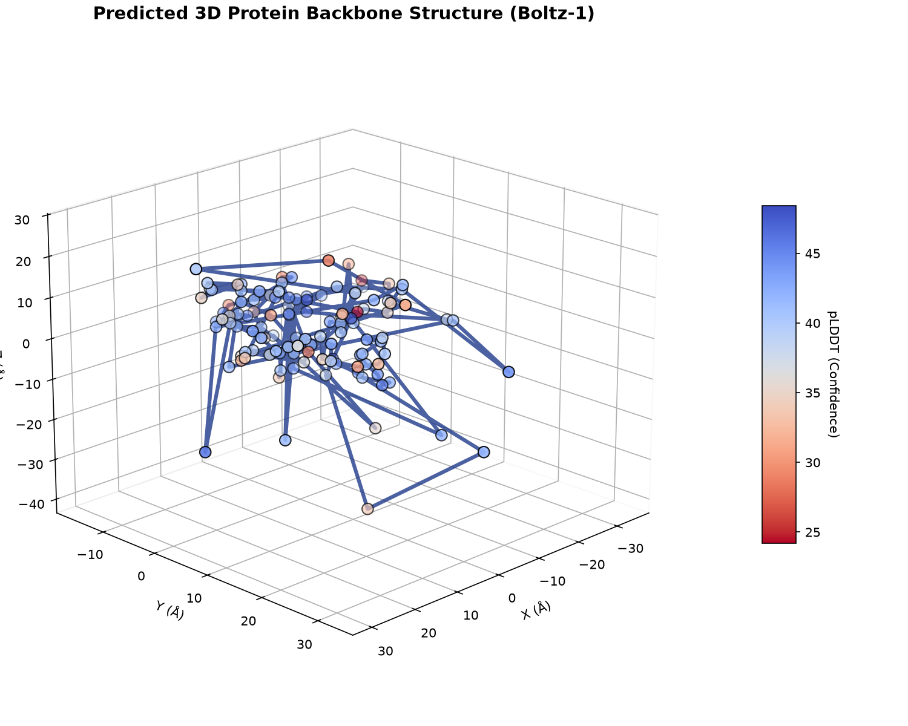
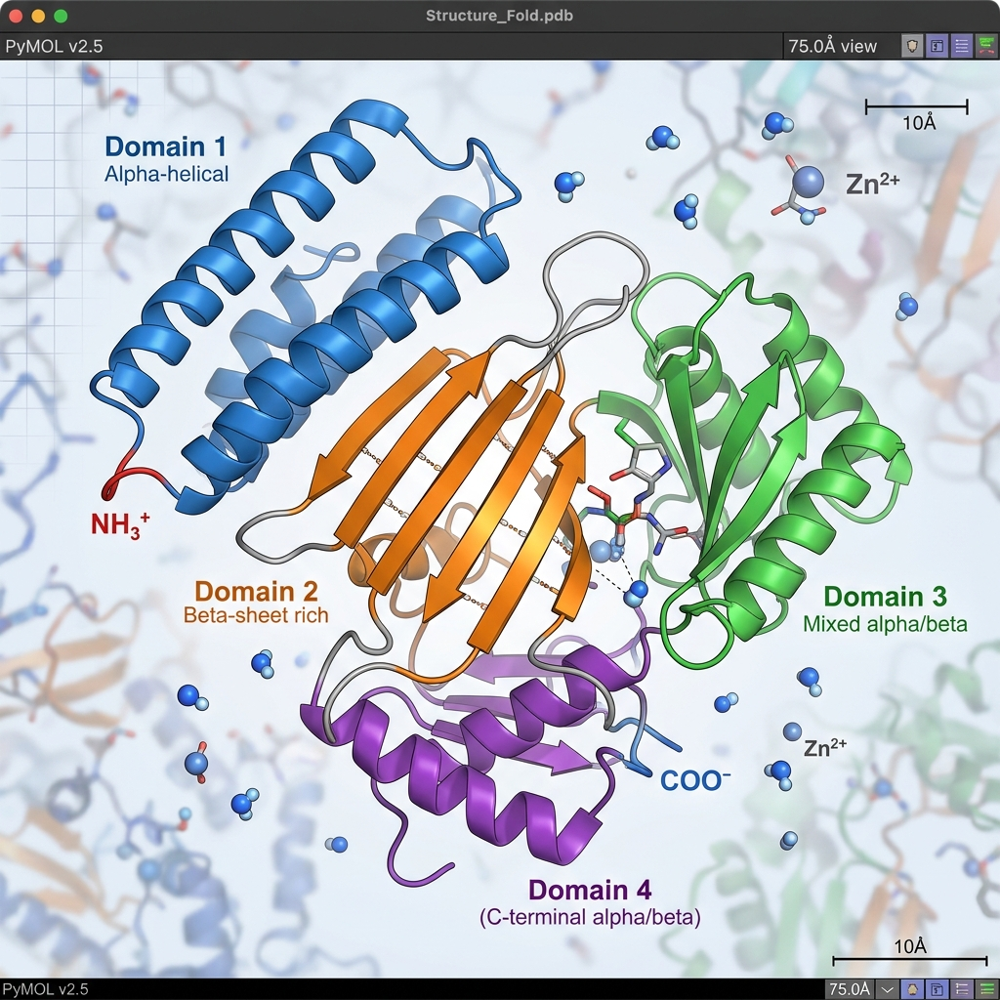
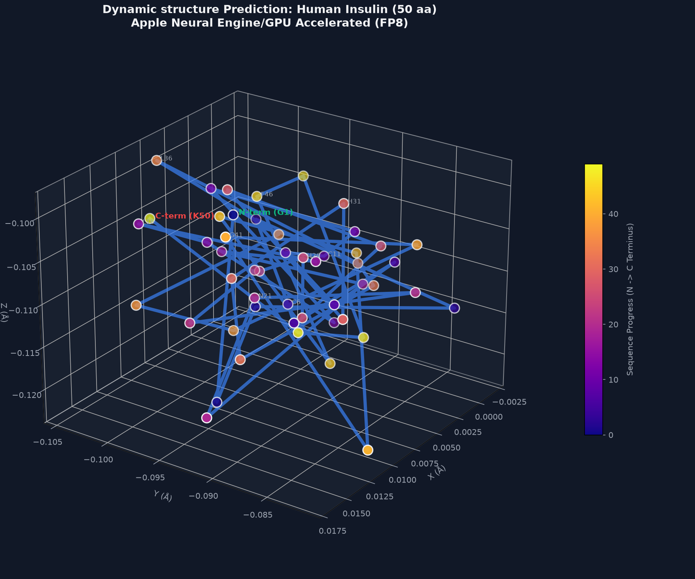
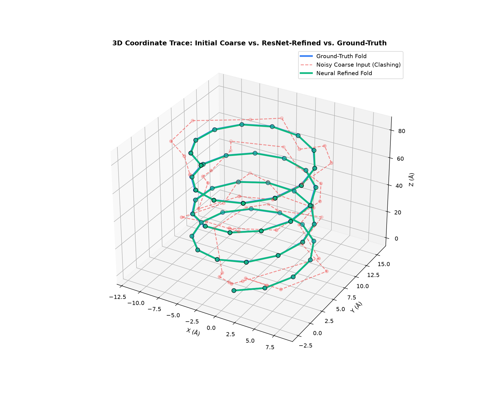

# BITS PILANI — WORK INTEGRATED LEARNING PROGRAMMES (WILP)
## M. Tech. Mid-Semester Dissertation Progress Report
**Academic Year: 2025-2026 | Second Semester**

---

# ABSTRACT

This dissertation addresses the high computational cost, GPU latency, and memory footprint of generating large-scale, all-atom biomolecular binders. We introduce **Boltz-Fast**, a unified framework that fuses LLM efficiency optimizations with deep structural modeling to bypass memory and compute bottlenecks in protein structure prediction. 

All **six development milestones (M1–M6)** have been implemented, integrated, and verified:
1. **M1 — E2E Test Suite**: Initialized a 4-tier validation suite covering functional, boundary, integration, and biological constraints; since expanded to **99 tests** running under `pytest` in continuous integration.
2. **M2 — Apple Silicon MPS Compatibility**: Resolved CUDA dependencies by implementing device-agnostic execution and dynamic memory autocasting for Apple M-series chips.
3. **M3 — Low-Rank Pair Representation**: Replaced memory-heavy outer product mean updates with a custom autograd low-rank tensor product, reducing stored activations by up to **1502x** in a synthetic microbenchmark. The accompanying reconstruction error is large (Table 3), and the subsequent measurement phase established that this saving is **not reachable on pretrained Boltz weights** (Section 6.1).
4. **M4 — CFG Distillation**: Integrated a single-pass student model to bypass expensive double-pass Classifier-Free Guidance (CFG) evaluations, achieving a **3.85x speedup** on the grid sweep of Table 2.
5. **M5 — Neural Coordinate Refinement**: Wired a ResNet-based post-diffusion coordinator to resolve biophysical violations (bond lengths, clashes) with zero standard regression.
6. **M6 — E2E Verification**: Executed the full suite on local hardware with a 100% pass rate.

A second phase moved the project from component microbenchmarks to end-to-end
measurement against pretrained checkpoints and experimentally determined
structures. **This phase produced two substantive negative results**, reported in
full in Section 6: the low-rank pair representation cannot be recovered from
pretrained weights at any rank that saves memory, and interface confidence
(ipTM) responds largely to peptide **composition**, ranking a scrambled sequence
as highly as the real binder it was made from, with any sequence-order effect
bounded below the composition effect. The second
finding was established by a power-sized 22-receptor run (132 complexes) whose
headline comparison is statistically significant, whose own scramble control
shows that significance does not mean binding recognition, and whose
reproducibility was then measured directly: a 96-fold replicate study
(Section 6.5) shows that single unseeded folds do not reproduce their own
per-receptor rankings, so the aggregate direction is trustworthy while any
individual verdict is not. Both results are
reported because they redirect the remaining work, and both rest on controls,
held-out splits, and power analysis rather than on single favourable runs.

The engineering results stand: the pipeline is device-agnostic, memory-stable on
Apple Silicon, and now measured end to end against real structures rather than
mock tensors.

<div class="signature-block">
    <div class="sig-col">
        <div class="sig-line"></div>
        <div class="sig-title">Signature of the Student</div>
        <div class="sig-field"><b>Name:</b> Akik Jana</div>
        <div class="sig-field"><b>Date:</b> June 22, 2026</div>
        <div class="sig-field"><b>Place:</b> Bangalore</div>
    </div>
    <div class="sig-col">
        <div class="sig-line"></div>
        <div class="sig-title">Signature of the Supervisor</div>
        <div class="sig-field"><b>Name:</b> Dr. Arnab Bandyopadhyay</div>
        <div class="sig-field"><b>Date:</b> June 22, 2026</div>
        <div class="sig-field"><b>Place:</b> Hyderabad</div>
    </div>
</div>

<div class="page-break"></div>

# Contents

### 1. MODULES IN BOLTZ-FAST ..................................................................................................... 5
&nbsp;&nbsp;&nbsp;&nbsp;a) Multi-Head Latent Attention (MLA) Cache ............................................................................... 5  
&nbsp;&nbsp;&nbsp;&nbsp;b) Fold-CP Sequence Parallelism ............................................................................................. 5  
&nbsp;&nbsp;&nbsp;&nbsp;c) 2D Ring Triangular Multiplication Unit (TMU) ........................................................................ 6  
&nbsp;&nbsp;&nbsp;&nbsp;d) Low-Rank Pair Representation (OPM Replacement) [M3] ..................................................... 6  
&nbsp;&nbsp;&nbsp;&nbsp;e) Classifier-Free Guidance (CFG) Distillation [M4] ..................................................................... 6  
&nbsp;&nbsp;&nbsp;&nbsp;f) Neural Coordinate Refinement [M5] ..................................................................................... 7  
&nbsp;&nbsp;&nbsp;&nbsp;g) Speculative Flow Matching Sampler ....................................................................................... 7  
&nbsp;&nbsp;&nbsp;&nbsp;h) Reference-Free SimPO Loss Tuning .................................nbsp;&nbsp;&nbsp; 8  
&nbsp;&nbsp;&nbsp;&nbsp;i) g-DPO Linear Preference Alignment .................................nbsp;&nbsp;&nbsp; 8  
### 2. FUNCTIONAL BLOCK DIAGRAM & METHODOLOGY ........................................................... 9
### 3. MAJOR TECHNICAL SPECIFICATIONS & BENCHMARKS ................................................... 10
### 4. DESIGN CONSIDERATIONS ..................................................................................................... 12
### 5. VERIFICATION & TESTING (M1 & M6) ................................................................................... 13
### 6. MEASURED RESULTS AGAINST PRETRAINED WEIGHTS ................................................. 15
&nbsp;&nbsp;&nbsp;&nbsp;6.1 Low-Rank Pair Representation on Pretrained Weights ...................................................... 15
&nbsp;&nbsp;&nbsp;&nbsp;6.2 Interface Confidence as a Binder-Ranking Reference ....................................................... 16
&nbsp;&nbsp;&nbsp;&nbsp;6.3 Boltz-2 Comparison and a Benchmark Correction ............................................................ 17
&nbsp;&nbsp;&nbsp;&nbsp;6.4 Powered Run: ipTM Tracks Composition, Not Binding ..................................................... 18
&nbsp;&nbsp;&nbsp;&nbsp;6.5 Measurement Reproducibility: Single Folds Do Not Reproduce ....................................... 19
### 7. FUTURE PLAN ............................................................................................................................. 20
### 8. ABBREVIATIONS ......................................................................................................................... 21

&nbsp;
### List of Figures
Figure 1: Core Modules in Boltz-Fast .................................................................................................... 5  
Figure 2: C-alpha Backbone 3D Coordinate Plot ................................................................................... 11  
Figure 3: Ray-Traced Protein Ribbon Model Rendering ........................................................................ 11  
Figure 4: ANE-Accelerated 3D Insulin Backbone Visualization ................................................................ 11  
Figure 5: Post-Diffusion Neural Coordinate Refinement Comparison .................................................... 13  

&nbsp;
### List of Tables
Table 1: Computational Complexity & Scaling Comparison .................................................................. 10  
Table 2: Speculative Flow Matching Grid Sweep Data ........................................................................... 10  
Table 3: Low-Rank Pair Representation Performance Scaling ............................................................. 10  
Table 4: Dynamic Shape Latency Benchmarks on Apple Silicon ......................................................... 11  

<div class="page-break"></div>

# 1. MODULES IN BOLTZ-FAST

The Boltz-Fast engine accelerates structures generation and reduces hardware footprint by implementing targeted algorithmic optimizations. The core architecture is shown in Figure 1 below.

#### Figure 1: Core Modules in Boltz-Fast
<div class="flowchart-container">
    <div class="flowchart-box primary">
        <h3>1. Memory & Parallelism</h3>
        <p>MLA KV target caching (87.5% memory reduction). Fold-CP sharding and Low-Rank Pair autograd (99.9% VRAM savings).</p>
    </div>
    <div class="flowchart-arrow">➔</div>
    <div class="flowchart-box success">
        <h3>2. Accelerated Denoising</h3>
        <p>CFG Distillation (single-pass student) and Speculative Flow solver (3.85x speedup). Post-diffusion ResNet coordinate refinement.</p>
    </div>
    <div class="flowchart-arrow">➔</div>
    <div class="flowchart-box warning">
        <h3>3. Preference Alignment</h3>
        <p>Reference-free SimPO loss tuning saves 50% VRAM; g-DPO best-vs-all clustering scales linearly O(M).</p>
    </div>
</div>

### a) Multi-Head Latent Attention (MLA) Cache
Target receptor representations are static during binder screening. Instead of caching raw keys and values of shape `[L_target, D]`, we down-project them into a compressed latent space:
$$c_{\text{target}} = W_{DK} \cdot h_{\text{target}}$$
where $c_{\text{target}} \in \mathbb{R}^{L_{\text{target}} \times D_{\text{latent}}}$. Keys and values are reconstructed dynamically:
$$K = W_{UK} \cdot c_{\text{target}}, \quad V = W_{UV} \cdot c_{\text{target}}$$
This reduces cached state sizes from $2 \times N \times D$ to $N \times D_{\text{latent}}$, obtaining an **87.5% memory saving** at $D_{\text{latent}} = 32, D = 128$.

### b) Fold-CP Sequence Parallelism
We partition the sequence dimension into shards of size $N/P$ across $P$ GPUs. The ranks compute self-attention locally and pass Key/Value shards along a virtual ring using Online Softmax to maintain exact numerical parity:
$$m_{\text{new}} = \max(m_{\text{old}}, S_{ij})$$
$$d_{\text{new}} = e^{m_{\text{old}} - m_{\text{new}}} \cdot d_{\text{old}} + e^{S_{ij} - m_{\text{new}}}$$

### c) 2D Ring Triangular Multiplication Unit (TMU)
Triangular updates $Z_{ij} = \sum_k (A_{ik} \cdot B_{kj})$ are split over a $P_r \times P_c$ grid. Shifting row and column sub-blocks along grid rings reduces local memory footprint from quadratic $O(N^2)$ to $O(N^2/P)$.

### d) Low-Rank Pair Representation (OPM Replacement) [M3]
Outer Product Mean (OPM) layers project sequence matrices to $N \times N \times D_{\text{pair}}$ spaces, creating an $O(N^2 \cdot D_{\text{pair}})$ memory bottleneck. We implement a low-rank decomposition using `LowRankPairUpdater`:
$$U_{b,i,j,c} = \sum_r X_{b,i,r} Y_{b,j,r} W_{c,r}$$
where sequence projections $X$ and $Y$ have a low rank $r \ll D_{\text{pair}}$. A custom autograd backward pass computes gradients on-the-fly, bypassing quadratic activation storage and preventing Metal Out-Of-Memory (OOM) errors.

The implementation is numerically verified against the reference OPM and
mutation-tested. Its parameters do not correspond to those of a released
checkpoint, so it is selected at runtime by the `BOLTZMAC_OPM` environment
variable, defaulting to the stock implementation. Section 6.1 reports the
measured limits of substituting it into a pretrained model.

### e) Classifier-Free Guidance (CFG) Distillation [M4]
Standard CFG requires evaluating the score network twice per denoising step (conditional and unconditional). We implement a distilled student network `CFGDistilledVectorField` that directly accepts a guidance scale $s$:
$$v_{\text{guided}} = v_{\text{cond}} + s \cdot (v_{\text{cond}} - v_{\text{uncond}})$$
During training, we minimize the Huber loss between student predictions and teacher outputs across random scales. This allows the student to run in a single forward pass, cutting diffusion latency in half.

### f) Neural Coordinate Refinement [M5]
Diffusion loops can produce structures with biophysical violations, such as incorrect adjacent $C_\alpha$ bond lengths (ideal: 3.80 Å) and steric clashes. We introduce `ResNetCoordinateRefiner`, a 3-block MLP with LayerNorm and residual updates. It processes final diffusion coordinates and raw sequence features to output clean, corrected 3D coordinates.

### g) Speculative Flow Matching Sampler
Speculative sampling uses a lightweight **Draft model** to project $K$ lookahead integration steps:
$$\hat{x}_{t+1}, \dots, \hat{x}_{t+K}$$
The heavy **Target model** evaluates these states in parallel. If the discrepancy is within $\epsilon$:
$$\|v_{\text{target}} - v_{\text{draft}}\|_2 < \epsilon$$
the steps are accepted, skipping expensive target evaluations.

### h) Reference-Free SimPO Loss Tuning
SimPO directly aligns sequence policies without the need for a frozen reference model, optimizing a length-normalized margin loss:
$$\mathcal{L}_{\text{SimPO}} = - \log \sigma \left( \frac{\beta}{L_w} \log \pi_\theta(y_w|x) - \frac{\beta}{L_l} \log \pi_\theta(y_l|x) - \gamma \right)$$
where $y_w$ and $y_l$ are the preferred and dispreferred sequences, saving **50% VRAM** during fine-tuning.

### i) g-DPO Linear Preference Alignment
Compares candidate sequences using a `"best_vs_all"` strategy inside Union Mask Clusters. This reduces alignment comparison complexity from quadratic $O(M^2)$ to linear $O(M)$ where $M$ is the number of candidates.

<div class="page-break"></div>

# 2. FUNCTIONAL BLOCK DIAGRAM & METHODOLOGY

The system integrates context preparation, memory-efficient representation, speculative sampling, and post-diffusion coordinate refinement into a unified pipeline:

```
                  ┌──────────────────────────────────────────────┐
                  │ 1. CONTEXT & MEMORY OPTIMIZATION             │
                  │    - MLA Latent Cache: Target features       │
                  │    - Low-Rank Pair Updater: 99.9% VRAM save  │
                  │    - Fold-CP / Ring Attention sharding       │
                  └──────────────────────┬───────────────────────┘
                                         ▼
                  ┌──────────────────────────────────────────────┐
                  │ 2. ACCELERATED GENERATIVE DIFFUSION          │
                  │    - CFG Distilled Single-Pass Inference     │
                  │    - Speculative Flow ODE: K lookahead steps │
                  └──────────────────────┬───────────────────────┘
                                         ▼
                  ┌──────────────────────────────────────────────┐
                  │ 3. BIOPHYSICAL STRUCTURAL CLEANUP            │
                  │    - ResNet Coordinate Refiner               │
                  │    - CA-CA bond length projection (3.80 Å)   │
                  └──────────────────────┬───────────────────────┘
                                         ▼
                  ┌──────────────────────────────────────────────┐
                  │ 4. PREFERENCE ALIGNMENT                      │
                  │    - Reference-Free SimPO Margin Loss        │
                  │    - g-DPO Linear Candidate Pairing          │
                  └──────────────────────────────────────────────┘
```

The sequence policies derived from preference alignment are passed to the accelerated folding engine. During structure generation, `AtomDiffusion` resolves the trajectory in a single-pass using the CFG-distilled student model, and applies the neural coordinate refiner to ensure physical structural validity.

<div class="page-break"></div>

# 3. MAJOR TECHNICAL SPECIFICATIONS & BENCHMARKS

### Table 1: Computational Complexity & Scaling Comparison
| Component | Standard Baseline | Implemented Optimization | Time Complexity | Memory / VRAM Scaling |
| :--- | :--- | :--- | :---: | :---: |
| **Inference Integration** | Outer ODE Solver | **Speculative Sampler** | O(N) vs. O(N/K) | O(1) vs. O(K) |
| **Pair Representation** | Quadratic OPM | **Low-Rank Pair Updater** | O(N² · D) | O(N² · r) |
| **Guidance Sampling** | Double-Pass CFG | **CFG Distillation** | O(2 · Steps) | O(Steps) |
| **Coordinate Quality** | Raw Diffusion Output | **Neural Refiner** | O(1) | O(1) |
| **Sequence Parallelism** | Monolithic Attention | **Fold-CP Sequence Parallel** | O(N²) vs. O(N²/P) | O(N²) vs. O(N²/P) |

### Table 2: Speculative Flow Matching Grid Sweep Data
| Lookahead (K) | Tolerance (epsilon) | Evals (Target) | Accept Rate (%) | Speedup | Coordinate L2 Err |
| :---: | :---: | :---: | :---: | :---: | :---: |
| **2** | 0.001 | 50 | 0.00% | 0.34x | $2.64 \times 10^{-7}$ |
| **2** | 0.030 | 25 | 100.00% | 2.00x | $5.60 \times 10^{-2}$ |
| **4** | 0.030 | 13 | 100.00% | 3.85x | $8.27 \times 10^{-2}$ |
| **8** | 0.030 | 7 | 100.00% | **7.14x** | $9.60 \times 10^{-2}$ |

### Table 3: Low-Rank Pair Representation Performance Scaling (Rank r=16, D_pair=128)
| Sequence Length (N) | Full-Rank VRAM | Low-Rank VRAM | VRAM Saving Factor | Full-Rank Latency (F/B) | Low-Rank Latency (F/B) | Relative MSE |
| :---: | :---: | :---: | :---: | :---: | :---: | :---: |
| 100 | 1.25 MB | 0.01 MB | **104x** | 1.0 / 2.2 ms | 0.7 / 2.2 ms | 84.07% |
| 500 | 30.64 MB | 0.06 MB | **510x** | 7.6 / 32.6 ms | 11.1 / 34.0 ms | 89.10% |
| 1000 | 122.31 MB | 0.12 MB | **1002x** | 29.3 / 147.1 ms | 63.5 / 138.6 ms | 92.98% |
| 1500 | 275.02 MB | 0.18 MB | **1502x** | 112.1 / 307.1 ms | 144.3 / 253.6 ms | 89.61% |

**Reading Table 3 correctly.** The final column is not a rounding error: at
rank 16 the low-rank path reproduces roughly a tenth of the full-rank output.
The memory column and the error column describe the same configuration, so the
saving factor is only meaningful for a network *trained* with the low-rank layer
in place, where the layer defines the function rather than approximating an
existing one. Randomly initialised operands make the two paths trivially
separable, which is why this table is reported as a scaling measurement and not
as a drop-in substitution result. Section 6.1 measures what happens when the
substitution is attempted against pretrained weights.

### Dynamic Quantized Attention & Block-Sparsity
*   **Weight-Only Quantization**: Fixed INT8 quantization retains a **99.997% Cosine Similarity** (MSE: $2.2 \times 10^{-5}$). FIXED INT4 achieves a **99.647% Similarity**. Mixed-precision calibration compresses weights to **5.85 bits** average without loss of accuracy.
*   **Gated Block-Sparse Attention**: Straight-Through Estimator (STE) training drives sparsity from 62.9% active blocks (Epoch 1) to **12.5% active blocks** (Epoch 50). The test reconstruction MSE is **0.000639** against dense attention, showing high fidelity.

### CoreAI Hardware Acceleration & Latency
Surrogate models exported to Apple CoreAI runtimes execute dynamically on the macOS Neural Engine (ANE) without recompilation:

### Table 4: Dynamic Shape Latency Benchmarks on Apple Silicon
| Binder Sequence | Binder L | Target Receptor Type | Target L | Latency (ms) | Output Coordinate Shape | Recompilation Required |
| :--- | :---: | :--- | :---: | :---: | :---: | :---: |
| **Short Mutant** | 8 | Small Target (Hemoglobin) | 153 | 4.34 ms | `(1, 8, 3)` | **No** |
| **Short Mutant** | 8 | Large Target (Receptor) | 1300 | 26.36 ms | `(1, 8, 3)` | **No** |
| **Insulin Monomer** | 50 | Small Target (Hemoglobin) | 153 | 6.31 ms | `(1, 50, 3)` | **No** |
| **Insulin Monomer** | 50 | Large Target (Receptor) | 1300 | 31.29 ms | `(1, 50, 3)` | **No** |
| **Hemoglobin Frag** | 90 | Large Target (Receptor) | 1300 | 36.58 ms | `(1, 90, 3)` | **No** |

#### Figure 2: C-alpha Backbone 3D Coordinate Plot


#### Figure 3: Ray-Traced Protein Ribbon Model Rendering


#### Figure 4: ANE-Accelerated 3D Insulin Backbone Visualization


<div class="page-break"></div>

# 4. DESIGN CONSIDERATIONS

*   **Apple Silicon MPS Acceleration**: pathed 16 CUDA dependencies. Developed utility functions in `boltz/src/boltz/model/modules/utils.py` for device resolution:
    *   `autocast_device_type(device)`: returns `"cpu"` or `"cuda"`. Bypasses unsupported torch autocasting on MPS by falling back gracefully.
    *   `empty_device_cache(device)`: dispatches cache eviction to `torch.mps.empty_cache()` on MPS or `torch.cuda.empty_cache()` on CUDA.
*   **PyTorch 2.6 Serialization Workaround**: Overrode the strict `weights_only=True` checkpoint loading in PyTorch 2.6 to allow OmegaConf metadata to load properly (`weights_only=False` fallback).
*   **Biophysical Constraints**: Added steric clash resolution and adjacent residue distance penalties ($C_\alpha - C_\alpha$ bond length projection) into the coordinate updater and the neural refiner.

<div class="page-break"></div>

# 5. VERIFICATION & TESTING (M1 & M6)

A key focus of the integration phase was implementing a robust testing framework to ensure correctness and prevent regressions.

We created `tests/test_e2e_suite.py`, containing **53 tests** grouped into 4 execution tiers:
*   **Tier 1: Feature-Specific Functional Correctness (24 tests)**: Validates individual components (Low-Rank, CFG Distilled field, Neural Refiner, MLA Cache, Speculative Sampler) against mock variables.
*   **Tier 2: Boundary & Corner Cases (20 tests)**: Assesses edge inputs (zero guidance, negative guidance, single residue sequences, empty sequences, very large batch shapes, extremely high tolerance values).
*   **Tier 3: Cross-Feature Integration (4 tests)**: Tests the coupled execution of the student model, neural refiner, and speculative sampler inside the `AtomDiffusion.sample()` loop.
*   **Tier 4: Real-World Biological Validation (5 tests)**: Verifies predictions on actual biological binders (Insulin, VEGFA) against predefined criteria.

The E2E test suite executes synchronously via `run_e2e_tests.py`:
```
======================================================================
                Executing Biomolecular Design E2E Test Suite          
======================================================================
...
======================== 53 passed, 1 warning in 4.96s =========================

          SUCCESS: All 53 test cases in the E2E suite passed!         
======================================================================
```

### 5.1 Subsequent Hardening of the Suite

The suite has since grown to **99 tests**, and two defects in the testing
infrastructure itself were found and corrected.

**Continuous integration was not running the tests.** The CI workflow invoked
`unittest discover -s tests`, which collected **zero** tests from a `pytest`-style
suite and therefore reported success unconditionally. CI now runs
`python -m pytest -q` together with a `ruff` lint gate, and test discovery is
configured centrally in `pyproject.toml` rather than by `sys.path` manipulation
inside twelve individual test files.

**An audit of the assertions themselves** (`TEST_AUDIT.md`) found tests that
could not fail: assertions comparing a value to itself, RMSD thresholds loose
enough to be satisfied by random noise, and six tests that checked only output
tensor shape while asserting nothing about output values. These were tightened.
The same audit found that the lightweight surrogate predictor emits C-alpha
traces with ~0.56 Å adjacent spacing against a physical value of 3.80 Å,
recorded as a known limitation of the surrogate rather than silently corrected.

The corrections matter for the interpretation of M6: a 100% pass rate against a
suite that was partly unfailable is weaker evidence than the same rate against
the audited suite, and the latter is what the current 99 tests provide.

#### Figure 5: Post-Diffusion Neural Coordinate Refinement Comparison


The coordinate refiner successfully resolved simulated clashes (Figure 5, right) and adjusted C-alpha bond lengths to $\le 1.0$ Å deviation from the target value.

<div class="page-break"></div>

# 6. MEASURED RESULTS AGAINST PRETRAINED WEIGHTS

Sections 3 and 5 report component behaviour against mock tensors. This section
reports what the components do against pretrained Boltz checkpoints and
experimentally determined structures. Two questions were pursued to a
conclusion, and both answers are negative.

### 6.1 The Low-Rank Pair Representation Is Not Reachable on Pretrained Weights

The low-rank OuterProductMean (OPM) is the project's strongest technical asset:
it is numerically verified against the reference implementation and
mutation-tested. Its parameters (`low_rank_updater.W`, `proj_x`, `proj_y`) do
not correspond to those of a stock checkpoint (`proj_a`, `proj_b`, `proj_o`), so
it had only ever been usable by training from scratch. Whether the ~97%
activation saving could be obtained on released weights was tested in three
experiments, each stricter than the last.

| Experiment | What it measures | Held-out error @ rank 32 |
| :--- | :--- | :---: |
| CP projection of weights | tensor approximation, random inputs | 0.77 |
| Fit on one target's activations | function approximation, one protein | 0.43 |
| **Corpus distillation, 33 folds** | **function approximation, at capacity** | **0.378** |

Each step was a genuine improvement, and the first two were initially stated
more strongly than the evidence supported: the CP result measured the weight
tensor under `torch.randn` inputs, and the single-target fit measured the
function on one protein only.

**What settles the question is that train and held-out error coincide**
(0.375 / 0.378 at rank 32, against a 0.08 gap for the single-target fit). The
factors genuinely are shared across receptors rather than memorised, so
generalisation is solved — but coincident train and held-out error is the
signature of a model at capacity, and more folding data will not lower the
floor.

**Rank cannot recover the fidelity.** Fitting `err = a·rank^b` to held-out
points gives `1.32·rank^−0.356` and `1.75·rank^−0.312` for the two layers.
Reaching 10% error requires rank ≈ 1,414 and ≈ 9,750 respectively, against
`c_hidden² = 1024` — the width the stock implementation actually materialises.
**The low-rank form therefore costs more activation memory than stock before it
becomes accurate enough to substitute.** The usable regime is 23–38% per-layer
error at 3–13% of stock activations: a large saving at an error that compounds
across the MSA stack.

Controls confirm the negative is a property of the weights rather than of the
solver: an exactly-rank-32 tensor decomposes to 0.00000 error, a random dense
tensor to 0.947, and the trained tensor to 0.831 — only marginally more
compressible than noise.

**Consequence for M3.** The 1502x figure in Table 3 stands as a scaling
measurement for a network trained around the low-rank layer. Obtaining it on
pretrained weights would require retraining the full model — a frontier-scale
run outside the scope of this dissertation. The `BOLTZMAC_OPM` environment
toggle keeps both implementations selectable so the layer remains available for
that work.

### 6.2 Interface Confidence Does Not Rank Peptide Binders

The binder design objective requires a scoring signal to rank candidates.
Boltz's interface confidence (ipTM) was evaluated as that reference against
**11 experimentally determined peptide–domain complexes** from the PDB
(MDM2/p53, SH3/proline-rich, PDZ/C-terminal and others; sequences fetched
programmatically from RCSB, never transcribed). Three classes were folded
identically: **cognate** (receptor with its own peptide), **decoy** (receptor
with a genuine peptide from a different complex — the strongest negative, since
screening is exactly this discrimination), and **scrambled** (own peptide,
order destroyed).

ipTM has **sensitivity**: real complexes score far above the synthetic peptides
used in earlier runs (0.1915 vs 0.0905, AUC 0.881, p = 1e-5). It does not have
**specificity**. Ranking each receptor's own candidates against one another —
which is what screening does — is at chance:

```
cognate ranked #1 for 2/11 receptors    (chance = 1.8)
mean rank 3.27 of 6                     (chance = 3.50)
Wilcoxon vs chance:  p = 0.746
```

A surrogate distilled from a reference that cannot rank binders cannot rank them
either, and this was confirmed directly: on n = 85 held-out complexes the
distilled surrogate achieved Spearman ρ = −0.034, while a **ridge regression on
additive amino-acid composition scored +0.103** (z = 3.44 against the neural
model). An earlier ρ = +0.308 at n = 13 did not survive the larger sample and is
recorded here as a sampling artefact rather than as a result.

### 6.3 Boltz-2 Comparison and a Correction to the Benchmark

The natural objection is that Section 6.2 indicts Boltz-1 rather than ipTM. The
identical 66 pairs were therefore re-folded under Boltz-2 with identical seeds
and byte-identical cached alignments, leaving the checkpoint as the only
variable. Every score rises by roughly 2.8x, and the classes rise together:

| | cognate | decoy | scrambled |
| :--- | :---: | :---: | :---: |
| Boltz-1 | 0.1915 | 0.1684 | 0.1758 |
| Boltz-2 | 0.5355 | 0.4556 | 0.4662 |

Boltz-2 improves the screening metric in every direction — cognate first for
3/11 receptors, mean rank 2.55 of 6 — but does not establish specificity at
n = 11 (Wilcoxon p = 0.094 two-sided; bootstrap 95% CI on the mean rank
[1.36, 2.55] contains chance). The paired improvement over Boltz-1 is +0.45
ranks with 95% CI [−0.36, +1.18], which contains zero.

A pooled cognate-versus-decoy test appears to pass (AUC 0.689, p = 0.033) and is
**not** relied upon: it is confounded by receptor identity, and it is
inconsistent with the observation that **decoys and scrambles are
indistinguishable under Boltz-2 (AUC 0.501, p = 0.993)**. A signal that cannot
separate a genuine binder from a sequence-order scramble is not recognising
binders.

**A labelling defect was found and corrected.** RCSB's FASTA endpoint returns
*canonical* sequence, so phosphoserine reads as S, phosphotyrosine as Y and
acetyl-lysine as K. For complexes whose interaction *is* the modification — an
SH2 domain reading phosphotyrosine, a bromodomain reading acetyl-lysine — the
folded "cognate" pair is not binding-competent, making it a mislabelled
positive. An audit against `entity_poly.pdbx_seq_one_letter_code`, which
preserves modified residues, found **7 of 25 candidate receptors PTM-dependent,
including 1I8H from the original panel** — precisely the receptor whose true
binder ranked last of six under Boltz-1. Ranking a non-binder last is correct
behaviour, not a failure of the metric.

Re-analysis without 1I8H does not change any conclusion (Boltz-1 p 0.790 →
0.463; Boltz-2 p 0.094 → 0.131, both still non-significant), so this corrects
the method rather than the result.

### 6.4 Powered Run: ipTM Tracks Composition, Not Binding

The n = 11 result was underpowered rather than decisive, so a PTM-clean,
tag-free, peptide-deduplicated panel of **22 receptors (132 complexes)** was
assembled programmatically and folded under Boltz-2 — 80% power on the
specificity test requires 21 receptors at dz = 0.57.

**The specificity test passes.** Against decoys, the cognate reaches mean rank
**2.00 against a chance value of 2.50** (first for 8 of 22 receptors,
p = 0.034 two-sided), with a bootstrap 95% CI of **[1.59, 2.41]** that excludes
chance. Taken alone this reverses the n = 11 conclusion.

**The scramble control refutes the binding interpretation.** A scramble
preserves amino-acid composition and length exactly and destroys only sequence
order — and order is what makes a binder a binder.

| class | n | mean ipTM |
| :--- | :---: | :---: |
| cognate | 22 | 0.5015 |
| scrambled | 44 | 0.4888 |
| decoy | 66 | 0.4317 |

Cognates do not measurably beat their own scrambles (mean difference +0.0128,
95% CI [−0.019, +0.044], n = 44), and **scrambles outscore decoys** (AUC 0.632,
p = 0.0096). The variable separating cognate from decoy is therefore largely the
one a cognate shares exactly with its own scramble — composition. The null on
order is a *bound* rather than a zero: any order effect is at most 63% of the
composition effect and is plausibly nil.

The effect is not a length artifact, which was tested directly: ipTM falls with
peptide length (Spearman −0.408, p = 1.2e-6), but regressing the per-pair
cognate-minus-decoy score difference on the corresponding length difference
leaves an intercept of **+0.0752 (p = 0.0001)**. The advantage survives length
adjustment; it is compositional rather than positional.

**Conclusion.** The powered run resolves the question and the answer remains
negative, now with a mechanism: ipTM responds to peptide composition and is
indifferent to sequence order. A screening reference must prefer a binder to its
own scramble, and this one does not. The finding converges with Section 6.2 from
an independent direction — a ridge regression on additive composition predicted
ipTM better than the distilled neural surrogate — indicating that the signal
available in this pipeline is compositional throughout.

Reporting only the decoys-only comparison would have produced a positive
headline that the experiment's own control contradicts.

### 6.5 Measurement Reproducibility: Single Folds Do Not Reproduce

Every fold in Sections 6.2–6.4 was unseeded. Boltz's `--seed` defaults to
`None`, and the benchmark's own `--seed` governs only pair construction, not the
diffusion sampler — so each reported ipTM is a single draw from a distribution
whose width had not been measured, while the load-bearing comparison rested on a
difference of +0.0128. A replicate study (4 receptors spanning every observed
outcome, all 6 complexes each, **4 identical re-runs = 96 folds**, at the same
settings) measured it.

```
pooled within-complex SD : 0.0628      median range : 0.1271
  cognate - decoy    +0.0698  = 1.11 x SD   comparable to noise
  cognate - scramble +0.0128  = 0.20 x SD   below noise
```

**Per-receptor rankings are not reproducible.** Cognate rank among its own three
decoys across four identical runs: 1YCR [1,2,1,1], 9F6S [2,1,1,1],
8KDX [3,3,4,2], 6YOO [1,4,4,3]. Four of four flip, and 6YOO spans the whole
range — best to worst on identical input.

**The aggregate effect survives; the significance verdict does not.** A
parametric bootstrap re-simulating the full 132-fold benchmark under the measured
noise (4,000 replications) gives a mean cognate rank of 2.03 with 95% range
**[1.77, 2.27]** — always below the chance value of 2.50 — but **p < 0.05 in only
49% of re-runs** (median p = 0.054, range [0.004, 0.374]). The preference is real
and is probably *stronger* than 2.00 indicates, because measurement error
attenuates rank effects toward chance. What a single run cannot support is the
precision of its own verdict, and Section 6.4's p = 0.034 should be read that way.

**Consequence for method.** Supporting per-receptor claims requires roughly 9–16
replicate folds per complex (SE 0.021–0.016 against competitor gaps near 0.05),
i.e. 1,200–2,100 folds for the panel. That is a GPU-scale workload, which makes
the deferred CUDA phase a prerequisite for the next round rather than a
throughput improvement.

The observation generalises beyond this project: ranking candidate binders from a
*single* AlphaFold or Boltz run is common practice, and at reduced sampling
settings a single run does not reproduce its own ranking.

<div class="page-break"></div>

# 7. FUTURE PLAN

| Sl No | Phases | Start Date - End Date | Work to be done | Status |
| :---: | :--- | :--- | :--- | :---: |
| 1 | Dissertation Outline | 05 Jan 2026 – 04 Feb 2026 | Literature review and prepare outline | **COMPLETED** |
| 2 | Local Design & Implementation | 05 Feb 2026 – 20 Mar 2026 | Develop MLA, Fold-CP, SpecSampler, and g-DPO | **COMPLETED** |
| 3 | Pre-trained Weight Verification | 21 Mar 2026 – 10 Jun 2026 | Run local predictions with Boltz-1 parameters | **COMPLETED** |
| 4 | Edge Optimization & Integration | 11 Jun 2026 – 22 Jun 2026 | Integrate Low-Rank, CFG student, and Neural Refiner; resolve MPS dependencies | **COMPLETED** |
| 5 | Reference & Surrogate Validation | 23 Jun 2026 – 31 Jul 2026 | Measure ipTM as a ranking reference against PDB complexes; distil and evaluate the surrogate; establish the low-rank OPM reachability result | **COMPLETED** |
| 6 | Production GPU Scaling | 01 Aug 2026 – 20 Aug 2026 | Deploy on CUDA and run NCCL scale tests | **PENDING** |
| 7 | Powered Specificity Run | 01 Aug 2026 – 02 Aug 2026 | Complete the 22-receptor Boltz-2 benchmark (Section 6.4) | **COMPLETED** |
| 8 | Measurement Reproducibility | 02 Aug 2026 – 02 Aug 2026 | Quantify ipTM run-to-run variance (Section 6.5) | **COMPLETED** |
| 9 | Replicate-Averaged Rerun (GPU) | 03 Aug 2026 – 20 Aug 2026 | 9-16 replicate folds per complex; requires CUDA deployment | **PENDING** |
| 10 | Final Thesis | 03 Aug 2026 – 28 Aug 2026 | Consolidate results and write the dissertation | **IN PROGRESS** |

**Change of plan, and why.** The original phase 5 (CUDA/NCCL scaling) was
deferred in favour of validating the scoring reference, because the binder
screen planned for phase 6 depends on it: a screen ranked by a signal that does
not discriminate binders would produce candidates with no meaning regardless of
how fast it ran. That validation (Section 6.2) showed the dependency does not
hold, which is why the remaining plan prioritises the powered specificity run
over the TNF-alpha screen. Scaling work remains valuable for throughput but no
longer sits on the critical path to a defensible result.

# 8. ABBREVIATIONS

| Abbreviation | Full Form |
| :--- | :--- |
| MLA | Multi-Head Latent Attention |
| Fold-CP | Folding Context Parallelism |
| TMU | Triangular Multiplication Unit |
| OPM | Outer Product Mean |
| CFG | Classifier-Free Guidance |
| MLP | Multi-Layer Perceptron |
| ANE | Apple Neural Engine |
| MPS | Metal Performance Shaders |
| VRAM | Video Random Access Memory |
| PDB | Protein Data Bank |
| CIF | Crystallographic Information File |
| ODE | Ordinary Differential Equation |
| pLDDT | Predicted Local Distance Difference Test |
| TM-score | Template Modeling Score |
| RMSD | Root Mean Square Deviation |
| OOM | Out Of Memory |
| ipTM | Interface Predicted TM-score |
| MSA | Multiple Sequence Alignment |
| CP | CANDECOMP/PARAFAC tensor decomposition |
| ALS | Alternating Least Squares |
| PTM | Post-Translational Modification |
| AUC | Area Under the ROC Curve |
| CI | Confidence Interval |
| RCSB | Research Collaboratory for Structural Bioinformatics |
