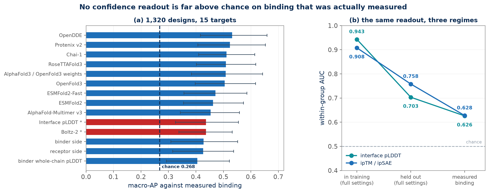
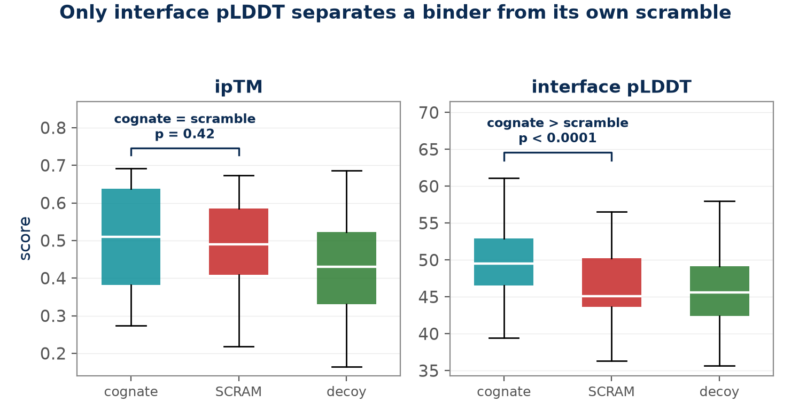
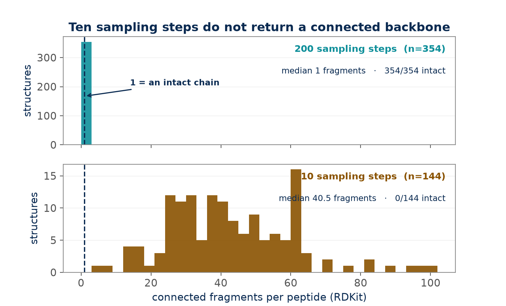
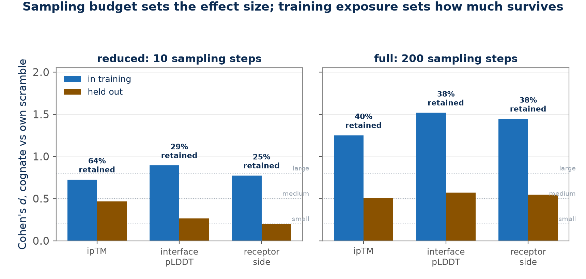
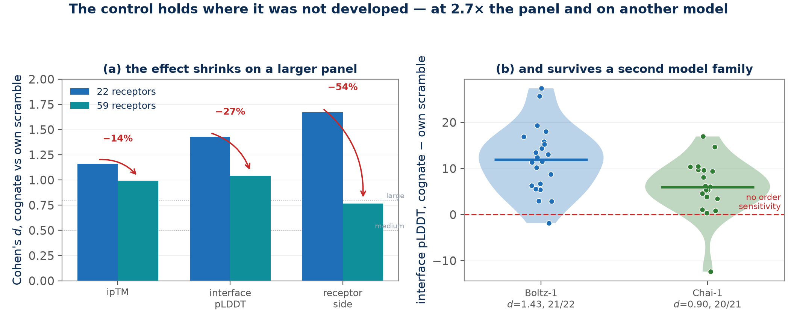

# Composition-matched controls change what cofolding confidence metrics appear to measure

**Akik Jana**

Birla Institute of Technology and Science, Pilani — Work Integrated Learning Programmes, Pilani, Rajasthan, India

Correspondence: akik.e.aj@gmail.com

---

## Abstract

Confidence scores from cofolding models — ipTM, interface pLDDT, pDockQ and their
relatives — are widely used to rank candidate binders before synthesis. On 1,320
designed miniproteins whose binding was measured by two independent contract
research organisations, and which postdate every model's training data, nine
published readouts span within-group AUC 0.621–0.671 against a 0.268 base rate:
every confidence interval covers or nearly covers chance. Our own recommended
readout reaches AUC 0.626 there, where our structure-derived panel gives 0.943.
This paper explains that gap with six controls, each of which overturned a result
that had looked solid without it. A composition-matched permutation control —
scoring a cognate peptide against permutations of itself, which fix amino-acid
composition and length and destroy only order — shows that ipTM ranks cognates
above unrelated decoys (mean rank 2.00 against chance 2.50) while failing to
separate a cognate from its own permutation; permutations in fact outscore decoys.
Of six interface readouts on identical structures, only interface pLDDT passes.
Replicate folding shows single unseeded folds do not reproduce their own ranking,
which forced two retractions in our own work. A training-cutoff split leaves 39–65% of the
standardised effect on a 44-receptor held-out panel, and under a second model
family Boltz-1's in-training advantage disappears entirely. Reducing sampling from 200 steps to 10
suppresses every effect threefold to sevenfold, and at ten steps the predicted
peptide backbone is not a connected chain at all; a full factorial over the three
inference settings shows alignment depth matters only once the sampler has
converged, and recycling not at all. We then test the controls where
they were not developed. On a panel 2.7 times larger the effect survives
(p = 5.3 × 10⁻¹² on 50 of 59 receptors) with every effect size 20–50% smaller, so
our original panel was a favourable draw. Under Chai-1, an independent model
family scored with the same readout code, a cognate beats its own permutation on
20 of 21 receptors, and the ranking test transfers almost exactly (top-1 76%
against 77%): order sensitivity is a property of cofolding confidence, not of one
model. Finally we bound the control itself on 900 designed proteins whose binding
was measured: the permutation correction adds nothing (ΔAUC −0.010, 95% CI
[−0.035, +0.014]), and not because it is inert — its margin separates binders from
non-binders at p = 4 × 10⁻¹² but correlates with the raw score at r = 0.82, so the
correction is redundant rather than constant. Use the control where a permutation
of the candidate remains a candidate. Applying what the controls leave standing —
a converged sampler and interface pLDDT rather than ipTM — ranks the true binder
first for 64% of 44 held-out receptors against a 25% chance rate, up from 41–50%
under the common default.

**Keywords:** protein structure prediction, cofolding, confidence metrics,
benchmarking, negative controls, peptide binders, data contamination

---

## 1. Introduction

Cofolding models predict the structure of a protein complex from sequence alone
[1–3], and each emits a confidence score intended to indicate how much of the
prediction should be believed. The open Boltz models [4,5] reproduce much of this
capability under permissive licences, which has made confidence-guided screening
tractable on commodity hardware. In a typical screening workflow, candidate
binders are folded against a target, ranked by ipTM [2] or a related interface
score, and the top-ranked candidates are synthesised.

The validation supporting this workflow is usually a discrimination test:
cognate binders are ranked against decoys, and the score is judged by whether
cognates rise. This is a real test, but it is a weak one, because a cognate
differs from an unrelated decoy in many ways at once — length, amino-acid
composition, hydrophobicity, charge, and sequence order. A score that responded
only to composition would pass it.

Permutation controls that hold composition fixed are standard practice in
sequence analysis, where shuffled-sequence nulls have been used for decades in
motif discovery and alignment statistics. They are, however, rarely reported in
cofolding benchmarks, where decoy sets are the norm. Our contribution is not the
idea of a permutation null but the systematic application of one to cofolding
confidence metrics, together with a measurement of the conditions under which it
is informative and the conditions under which it is not.

We begin from the outside. A recently released dataset of designed miniproteins
whose binding was measured experimentally [6] permits the comparison a
structure-derived panel cannot make: how a confidence readout performs against
binding somebody actually observed, on designs that postdate every model's
training data. Every readout scored on it, ours included, lands close to chance
(§2.1) — far below what benchmarks of these same readouts report.

The rest of the paper accounts for that gap. We apply six controls to a
peptide-binder screening panel of our own, and each removes part of it: the
permutation control (§2.2), the choice of readout (§2.3), replicate folding
(§2.4), a training-cutoff split (§2.5), and the sampling budget (§2.6). Each was
capable of overturning a result, and each did. We then test the controls
themselves — on a panel 2.7 times larger (§2.8) and on a second model family
(§2.9) — because a control that only works at the scale and on the model where it
was developed is not a control. We report the negative results in
full, including two conclusions of our own that the controls forced us to retract.
Finally we bound the first control by testing it against measured binding as well
(§2.7), and find a regime where it carries nothing.

---

## 2. Results

### 2.1 Against binding that was actually measured, no readout is far above chance

We begin with the check that does not depend on any panel we built. Benchmarks of
cofolding confidence almost always score a cognate pair that was *crystallised*,
which is evidence that two molecules can be co-ordered in a lattice, not a
measurement of binding. A recently released dataset [6] permits the direct test:
1,320 designed miniproteins across 15 targets, with binding measured by two
independent contract research organisations, and with designs postdating every
model's training data. 354 (26.8%) bind.

We recomputed interface pLDDT exactly as described in §4 from the Boltz-2 structures
released with that dataset. One implementation detail mattered: five targets are
oligomeric, so taking the first two chains as receptor and binder would have
measured a target against itself. The binder chain was identified by matching the
released binder length, with every other chain pooled as the target. All 1,320
designs scored.

**Table 1. Readouts against measured binding, and against structure-derived panels.**

| Setting | within-group AUC | macro-AP |
| :--- | ---: | ---: |
| Interface pLDDT, measured binding | 0.626 | 0.436 |
| ipSAE, same structures | 0.628 | 0.436 |
| chance | 0.500 | 0.268 |
| — for scale, same AUC convention (§2.5, §2.6) — | | |
| this work, in-training panel, full settings | 0.908–0.943 | — |
| this work, held-out panel, full settings | 0.683–0.758 | — |

All AUCs in this table use one convention: scores are z-standardised within
group — receptor for our panels, target for the designs — and pooled into a
single ROC. The held-out row is the mean of two independent full-settings draws.

The two lower rows are established in §2.5 and §2.6 and are quoted here only to
set the scale. These are not the same measurement: the panels differ, the
positives differ (a cognate crystal pair against a synthesised binder), and the
readouts differ in part. What they share is the question, and the ordering answers it. A readout
scored on complexes the model was trained on reads far higher than the same
family of readout scored against binding that was actually measured. The
contamination penalty of §2.5, measured internally on a training-cutoff split,
appears again from outside.

For context, nine other predictors scored on the same designs span within-target
AUC 0.621–0.671 and macro-AP 0.453–0.532. No structure-prediction confidence
readout in this comparison, ours included, is close to its own benchmark figures.

<b>Figure 1.</b> (a) macro-AP against measured binding for
every predictor scored on the release, with 95% confidence intervals; the dashed
rule is the base rate. Red bars are this work's readouts. Every interval covers
or nearly covers chance. (b) The same readout family across three regimes on one
AUC convention. The descent from a training-adjacent panel to measured binding is
about 0.28–0.32 AUC, and the held-out panel sits between the two. Panels differ
in molecules and in what counts as a positive, so (b) supports an ordering rather
than a numerical correction.

### 2.2 A composition-matched control separates two hypotheses that decoys conflate

The gap in §2.1 — 0.943 on a structure-derived panel against 0.626 on measured
binding — is the thing the rest of this paper explains. Sections 2.2 to 2.6 apply
six controls to a panel of our own, and each one removes part of that gap.

We assembled a panel of 22 receptors (132 complexes) from the Protein Data Bank
[10], filtered to remove post-translationally modified residues, expression tags,
and duplicate receptors or peptides. Each cognate peptide was folded against its
receptor, against three unrelated decoy peptides drawn from other receptors in
the panel, and against two permutations of itself. A permutation preserves
amino-acid composition and length exactly and destroys only the order of
residues — and order is what makes a binder a binder. We refer to these
interchangeably as permutations or *scrambles*, the latter being the term used
in our code and figure labels.

Against decoys, ipTM behaved as the literature would predict. The cognate reached
a mean rank of **2.00 against a chance value of 2.50** (first for 8 of 22
receptors, p = 0.034 two-sided, bootstrap 95% CI [1.59, 2.41] excluding chance).
Read alone, this is a positive result.

The permutation control contradicts the binding interpretation of it.

**Table 2. Mean ipTM by class on the 22-receptor panel (10 sampling steps).**

| class | n | mean ipTM |
| :--- | ---: | ---: |
| cognate | 22 | 0.5015 |
| scrambled | 44 | 0.4888 |
| decoy | 66 | 0.4317 |

Cognates did not measurably beat their own permutations (mean difference
+0.0128, 95% CI [−0.019, +0.044], n = 44), and permutations **outscored decoys**
(AUC 0.632, p = 0.0096). The variable separating cognate from decoy is therefore
largely the one a cognate shares exactly with its own permutation. The null on
order is a bound rather than a zero: any order effect is at most 63% of the
composition effect and is plausibly nil.

This is not a length artifact, which we tested directly. ipTM falls with peptide
length (Spearman −0.408, p = 1.2 × 10⁻⁶), but regressing the per-pair
cognate-minus-decoy score difference on the corresponding length difference
leaves an intercept of **+0.0752 (p = 0.0001)**: the advantage survives length
adjustment and is compositional rather than positional.

Reporting only the decoy comparison would have produced a positive headline that
the experiment's own control contradicts.

### 2.3 Of six interface readouts on identical structures, one passes

The finding in §2.2 indicts ipTM, not the predicted structures. We re-scored the
same 132 structures with six interface measures, so that the comparison between
readouts is free of folding variance by construction. Contacts use an 8 Å
CB–CB criterion (CA for glycine); pDockQ follows Bryant et al. [7]; buried area
is Shrake–Rupley.

**Table 3. Interface readouts on the permutation control.**

| Metric | cognate | scrambled | decoy | cognate vs own scramble | mean rank | chance |
| :--- | ---: | ---: | ---: | ---: | ---: | ---: |
| ipTM | 0.502 | 0.489 | 0.432 | p = 0.416 | 2.00 | 2.50 |
| pDockQ | 0.474 | 0.466 | 0.404 | p = 0.797 | 2.14 | 2.50 |
| **Interface pLDDT** | **49.60** | **46.31** | **45.93** | **p < 0.0001** | **1.91** | 2.50 |
| Inter-chain contacts | 32.9 | 38.5 | 34.0 | p = 0.054 | 2.55 | 2.50 |
| Contact density | 3.24 | 3.69 | 3.62 | p = 0.122 | 2.55 | 2.50 |
| Buried surface area | 1800 | 1861 | 1632 | p = 0.454 | 2.27 | 2.50 |

Only interface pLDDT separates a cognate from its own permutation. The behaviour
of pDockQ is instructive: it multiplies interface pLDDT by a contact term, and
the contact term runs the wrong way in this regime, because permuted peptides
make *more* inter-chain contacts than cognates (38.5 against 32.9). Combining the
two cancels the signal that interface pLDDT carries alone. Replacing pDockQ's
contact term with a PAE-derived one (pDockQ2 [8]) repairs it on the same
structures, from p = 0.797 to p = 0.00026.

<b>Figure 2.</b> ipTM (left) and interface pLDDT (right) by
class on the 22-receptor panel. Boxes span the interquartile range; the bracket
gives the paired test of a cognate against its own scramble. ipTM places
cognates above decoys while failing to distinguish them from permutations of
themselves; interface pLDDT separates both.

The cause of the inverted contact ordering is unconverged geometry rather than
peptide length: at 10 sampling steps only 14% of backbone bonds in these
structures fall within physically plausible bounds, against 96% for a
few-step-distilled model [9], and on converged structures the contact ordering
reverses to the sensible direction (cognates 61.4, permutations 51.8).

That claim rests on a bespoke distance metric, so we checked it against
PoseBusters [13], the standard structural-validity suite, on both regimes. The
peptide chain is treated as the molecule under test.

**Table 4. Peptide connectivity by sampling budget, PoseBusters / RDKit.**

| | 10 sampling steps | 200 sampling steps |
| :--- | ---: | ---: |
| structures | 144 | 354 |
| peptides that are a single connected fragment | **0 (0%)** | **354 (100%)** |
| median fragments per peptide | **40.5** | **1** |

The two columns come from structures folded in different environments (§4.1),
which is worth stating and does not matter here: Table 21 bounds that difference
at a few percent on continuous readouts, and this contrast is 0% against 100%.

At ten steps the backbone is not connected at all — a fifteen-residue peptide
comes back as roughly forty disjoint pieces — and at two hundred it is a single
chain in every structure. This is the physical form of the objection, in the
field's own vocabulary rather than ours.

<b>Figure 3.</b> Connected fragments per peptide, by sampling
budget, on a shared axis. At two hundred steps every peptide is a single chain;
at ten, none is, and the distribution centres near forty pieces. A fifteen-residue
peptide is not returned as a peptide.

One caution about that suite, because it would otherwise be misread. PoseBusters
is built for small molecules, and three of its checks are **vacuous** on a
peptide read from a PDB file: RDKit perceives bonds by distance, so a backbone
bond stretched past bonding range is never perceived as a bond and cannot fail a
length, angle or planarity test. Those checks report 100% pass on the very
structures that are in forty pieces. Its `all_atoms_connected` check is worse
than uninformative here — it reports 0% pass on the converged set, while RDKit's
own fragment count on the identical molecule returns one. **The fragment counts
in Table 4 are the trustworthy quantity**; we report no other PoseBusters
column. Every
contact-derived row of Table 3 should be read as describing point clouds rather
than complexes. **ipTM** is unaffected: it is a single scalar from the confidence
head with no coordinate dependence at all. **Interface pLDDT** is only partly
insulated, and we had previously described it as fully insulated. Its values come
from the head, but the residues it averages over are chosen by a distance cutoff
on the same coordinates PoseBusters faults — so it inherits their instability at
one remove. Across the 528 identical re-runs of §2.4, the receptor-side interface
averages 18.5 residues with a run-to-run SD of 6.35, a third of its own size:
the quantity is a head average taken over a membership that reshuffles between
folds. This does not affect the direction of any result reported here — interface
pLDDT remains the readout with the largest effect-to-noise ratio in Table 5 — but
it is why its run-to-run spread moves between environments where ipTM's does not
(below).

### 2.4 Single folds do not reproduce their own ranking

Boltz's sampler seed defaults to unset, so each reported score is one draw from a
distribution whose width is not reported. We folded a subset 96 times to measure
that width, then compared each readout's effect on the permutation control
against its own run-to-run spread.

**Table 5. Permutation-control effect against run-to-run spread.**

| Metric | effect | run-to-run SD | effect / noise |
| :--- | ---: | ---: | ---: |
| ipTM | +0.0128 | 0.0628 | 0.20× |
| pDockQ | +0.008 | 0.1498 | 0.05× |
| **Interface pLDDT** | **+3.30** | **1.917** | **1.72×** |

Interface pLDDT carries roughly **9 times** ipTM's effect-to-noise ratio on the
test that matters. Simulating the full benchmark under the measured noise gives a
cognate-minus-permutation effect of +3.30 pLDDT (95% CI [+2.13, +4.47]) that
reproduces at p < 0.05 in **100%** of re-runs, and a within-receptor rank of 1.91
(95% CI [1.64, 2.14]) reproducing in **84%**, against 49% for ipTM.

We emphasise the practical consequence, because it applied to our own work: two
conclusions we had drawn from single-draw comparisons did not survive replication
and were retracted. A benchmark that folds each candidate once is reporting a
sample of size one from a distribution wide enough to reverse its ordering.

**The spread in Table 5 was measured on four receptors, and we have since widened
it.** Repeating the design on all 22 receptors — 528 folds — moves the pooled SD
by 4% for interface pLDDT (2.479 → 2.376) and 2% for ipTM (0.0636 → 0.0646). The four receptors
were chosen to span the outcome range, and selecting extremes first is a
mechanism for inflating a spread, so this was worth checking; it did not happen.

The same experiment surfaced an apparent discrepancy that, on investigation,
turned out to be our own imprecision. Repeating the study on CUDA gave interface
pLDDT a spread 29% larger than the original (1.917 → 2.479) on the same four
receptors, while ipTM moved 1.3%. The two runs differed in two ways at once — CPU
against CUDA, and a local development build against a released one, differing in
46 of 106 shared source files — and we initially reported the gap as real but
unattributed.

It is neither. We refolded the original design a third time in the original
environment, and put an interval on the estimate:

**Table 6. Four estimates of the same quantity, and what one estimate is worth.**

| interface pLDDT run-to-run SD | environment | panel |
| ---: | :--- | :--- |
| 1.917 | CPU, development build | 4 receptors |
| **2.192** | **CPU, development build (refold)** | **4 receptors** |
| 2.479 | CUDA, released build | same 4 receptors |
| 2.376 | CUDA, released build | 22 receptors |

The refold's bootstrap 95% interval is **[1.877, 2.514]**, which contains every
other estimate in the table, including both values whose difference we had been
trying to explain. A pooled SD from 24 complexes folded four times carries about
**±8.3%** relative standard error, and the full 1.917–2.479 spread is a little
over two of those.

So there is no environment effect on the noise to explain. There is a noise floor
we measured too imprecisely to compare against itself. The four ipTM estimates
(0.0628, 0.0616, 0.0636, 0.0646) span 4.8% and tell the same story from the
stable side.

This is worth stating plainly because we made the error in the manuscript before
catching it: we measured a run-to-run spread, then compared two such spreads,
without ever putting an interval on the spread itself. §2.4's own conclusion — a
single draw does not pin a quantity — applies to the quantity in §2.4. Pinning an
SD to better than 10% needs more than 96 folds.

Table 5 retains its original SD. The asymmetry between the two readouts is still
consistent with §2.3 — ipTM is coordinate-free, interface pLDDT averages head
values over a coordinate-selected residue set — but on this evidence the
asymmetry is not established either, since neither estimate is precise enough to
separate from the other.

### 2.5 A training-cutoff split removes between a third and two thirds of the effect

Panels drawn from the PDB overlap the training data of every model trained on the
PDB. We assembled a second panel of 22 receptors released after the model's
training cutoff, filtered identically, with decoys drawn from within the held-out
set so that no fold in the comparison involves a training structure. Both panels
were then folded at the model's intended settings (200 sampling steps, 3
recycling passes, undiminished alignment depth), so that the only quantity
varying between them is whether the model has seen the complex.

**Table 7. The contamination penalty at full settings.**

| Readout | in-training | held out | *p* held out | effect retained | Cohen's *d* retained |
| :--- | ---: | ---: | ---: | ---: | ---: |
| ipTM | +0.287 | +0.169 | 0.0017 | 58.7% | **40.4%** |
| Interface pLDDT | +11.85 | +6.05 | 0.00047 | 51.1% | **37.6%** |
| Receptor side | +5.13 | +2.95 | 0.00075 | 57.6% | **37.9%** |

All three readouts remain significant on complexes the model was never trained
on, and roughly half the raw effect survives. Standardised, retention is
**37.6% to 40.4%** — materially worse than raw retention, because full settings
raise absolute confidence across the board and a raw difference is therefore
partly scale. Any figure quoted for a novel target should use the standardised
retention.

**At twice the panel the penalty is smaller than that.** Twenty-two receptors a
side is thin for a difference of differences, so we screened the PDB again for
post-cutoff entries and found 22 more that pass the identical filter, taking the
held-out panel to **44 receptors** (earliest release 2021-10-06).

**Table 8. The contamination penalty at 22 and 44 held-out receptors.**

| Readout | held out, *d* @22 | @44 | retained @22 | retained @44 | *p* @44 |
| :--- | ---: | ---: | ---: | ---: | ---: |
| ipTM | 0.59 | 0.76 | 51% | **65%** | 2.0e-06 |
| Interface pLDDT | 0.64 | 0.75 | 44% | **53%** | 2.8e-06 |
| Receptor side | 0.44 | 0.65 | 27% | **39%** | 3.0e-05 |

All three remain significant, and every retention figure rises. The honest
statement is now **39% to 65% of the standardised effect survives** — closer to
a half than the third this section originally reported, and the 22-receptor
figures were the pessimistic end.

Two caveats belong with that. The 22 added receptors are more recent and skew
toward shorter peptides, so part of the gain may be panel composition rather than
sample size. And this cuts the same way as §2.8, where a larger panel made the
scramble control's effect sizes *smaller*: the 22-receptor panel exaggerated
whichever direction a result pointed in. Small panels do not merely add noise.

<b>Figure 4.</b> Cohen's <i>d</i> on the scramble control
across the full 2×2 of training exposure and sampling budget, for three
readouts. Raising the sampling budget multiplies the in-training effect by 1.7
to 1.9 (left to right, blue bars); withholding the complex from training removes
about three fifths of it at full settings (blue to amber), and between a third
and three quarters at reduced settings, where the estimate is itself unstable.
Percentages give the standardised retention held out. Dotted rules mark Cohen's conventional
small/medium/large thresholds.

### 2.6 Sampling budget confounds every comparison above

The measurements in §2.2–2.3 were taken at 10 sampling steps of an intended 200,
a reduction adopted for throughput on consumer hardware. We folded the same panel
on the same model and device at full settings to measure what that reduction had
cost.

**Table 9. Permutation control at reduced and full settings.**

| Metric | reduced | full | Cohen's *d* | within-receptor z |
| :--- | ---: | ---: | :--- | ---: |
| ipTM | +0.039 (p = 0.004) | **+0.287 (p < 1e-5)** | 0.45 → **1.25** | 4.0× |
| Interface pLDDT | +1.54 (p = 0.067) | **+11.85 (p < 1e-5)** | 0.28 → **1.52** | 4.7× |
| Receptor side | +0.71 (p = 0.428) | **+5.13 (p < 1e-5)** | 0.12 → **1.45** | 7.3× |

Raw effects are 7.2 to 7.7 times larger at full settings; standardised, 2.7 to 12
times. The effect is larger at full settings for 21 of 22 receptors on ipTM and
interface pLDDT, with paired p ≤ 0.001 throughout, so it is not driven by
outliers. Two readouts change verdict outright: interface pLDDT from p = 0.067 to
p < 10⁻⁵, and the receptor side from p = 0.428 — no evidence at all — to
p < 10⁻⁵.

This has a direct bearing on §2.2. ipTM's indifference to sequence order is a
property of the reduced sampling regime at least as much as of the metric: at 200
steps the same model on the same panel separates a cognate from its own
permutation at *d* = 1.25. The claim that survives is the narrower one — **ipTM
is indifferent to sequence order when the sampler has not converged** — which
§2.3 identifies as the regime in which the predicted backbone is 14% physically
plausible.

To locate the cost we folded the full factorial: each setting alone, each pair,
and both endpoints — eight cells over the same 22 receptors, 1,056 folds.

**Table 10. The full factorial, order-sensitivity test on interface pLDDT.**

| Arm | steps / recycles / MSA | effect | Cohen's *d* | share of full gain |
| :--- | :--- | ---: | ---: | ---: |
| reduced | 10 / 1 / 32 | +1.54 | 0.28 | — |
| **sampling** | 200 / 1 / 32 | **+8.82** | **1.13** | **69%** |
| alignment | 10 / 1 / full | +0.83 | 0.18 | −8% |
| recycling | 10 / 3 / 32 | +1.40 | 0.22 | −5% |
| samp + recyc | 200 / 3 / 32 | +9.32 | 1.05 | 62% |
| **samp + align** | 200 / 1 / full | **+12.43** | **1.46** | **96%** |
| recyc + align | 10 / 3 / full | +1.84 | 0.30 | 1% |
| full | 200 / 3 / full | +11.85 | 1.52 | 100% |

Sampling steps alone carry **69%** of the standardised gain and take the readout
from marginal to p = 2.5 × 10⁻⁹. Moved alone, neither of the others carries any:
both shares are negative, each arm sitting marginally *below* the reduced
baseline.

**The pairs show that reading is incomplete.** An earlier version of this work
stopped at the single-knob arms and concluded that alignment depth does not
matter. It does — but only in company. Combined with sampling it reaches
*d* = 1.46, which is 96% of the full effect from two knobs rather than three, and
the interaction is genuinely positive:

**Table 11. Each pair against the sum of its two single knobs, standardised.**

| pair | observed gain | additive prediction | interaction | |
| :--- | ---: | ---: | ---: | :--- |
| sampling + recycling | +0.77 | +0.78 | **−0.01** | additive |
| **sampling + alignment** | **+1.18** | +0.74 | **+0.44** | **synergy** |
| recycling + alignment | +0.01 | −0.17 | +0.19 | weak synergy |

One caveat on how this table is assembled. The three single-knob arms and both
endpoints were folded in the local environment; the three pairs were folded on
the rented device (§4.1). Each interaction is therefore an observed pair minus an
additive prediction built from arms folded elsewhere. Table 21 bounds what that
can do: standardised effects run 6–7% lower in the released build, so the
observed column here is if anything slightly understated relative to the
predictions it is differenced against. Correcting for it moves the sampling ×
alignment interaction from +0.44 to roughly +0.51 and the sampling × recycling
one from −0.01 to +0.04 — neither changes a verdict, and the synergy would grow
rather than shrink. We report the uncorrected values.

Deep alignments do nothing while the sampler has not converged and contribute
substantially once it has. That is a coherent mechanism rather than a share: the
coevolutionary signal in a deep alignment can only express itself through a
pair representation the sampler has actually resolved, which §2.3 shows it has
not at ten steps.

Recycling is the knob that is genuinely inert. Its interaction with sampling is
**−0.01** — additive to two decimal places — and `sampling + recycling` slightly
*underperforms* sampling alone (1.05 against 1.13), which is within the
draw-to-draw noise of §2.4 and should be read as "no effect" rather than as harm.

**The practical recommendation, revised.** Under a compute constraint, spend first
on sampling steps and second on alignment depth; recycling passes are the ones to
drop. At 200 sampling steps, one recycling pass and undiminished alignment,
`sampling + alignment` recovers 96% of the full effect while skipping two
recycling passes over every fold. An earlier version of this recommendation said
to cut alignment depth first, on the strength of the single-knob arm alone; the
factorial shows that to be wrong.

### 2.7 Where the control stops working

The permutation control had itself never been tested against measured binding. We
registered a prediction in source, committed before any fold ran:

> These binders are 60 to 120 residue designed proteins, not the 5 to 25 residue
> peptides of the panel. A permutation of a 100-residue protein does not fold at
> all, so both binders and non-binders should receive an equally ruined scramble,
> and the subtraction may add nothing.

Thirty-eight designs across four targets (RBX1, PD-L1, TrkA, BHRF1) were folded
as delivered and against two permutations of each.

**Table 12. Interface pLDDT of a design and of its own permutations, by measured outcome.**

| | n | design | its permutations | margin |
| :--- | ---: | ---: | ---: | ---: |
| measured binders | 20 | 72.99 | 53.88 | **+19.11** |
| measured non-binders | 18 | 71.15 | 53.22 | **+17.93** |

The permutations lose about nineteen points of interface pLDDT whether the design
binds or not, and the two margins are indistinguishable (Welch p = 0.751). On the
single pre-specified comparison, the raw readout gave within-target AUC 0.672 and
the permutation-corrected margin gave 0.581 — ΔAUC **−0.092**, 95% CI [−0.170,
+0.008].

The interval includes zero, so the honest statement is that the control adds no
information about measured binding here, not that it actively destroys it, though
the point estimate was negative on every subset examined and stable as folds
accumulated (−0.056 at thirty designs, −0.092 at thirty-eight).

**The result is not an artifact of the sampling budget.** Those folds ran at ten
sampling steps, and §2.6 establishes that reductions of that kind suppress every
effect we measure — so a reasonable objection is that the control might work here
at converged settings and we simply could not see it. We therefore repeated the
experiment at 200 sampling steps and 3 recycling passes, on the full 48 designs
rather than the 38 the first attempt reached.

**Table 13. The same experiment at converged settings, 48 designs.**

| | n | design | its permutations | margin |
| :--- | ---: | ---: | ---: | ---: |
| measured binders | 24 | 80.08 | 59.27 | **+20.81** |
| measured non-binders | 24 | 81.30 | 59.02 | **+22.28** |

The conclusion is unchanged: Welch p = 0.677, and on the pre-specified comparison
ΔAUC = **−0.104**, 95% CI [−0.330, +0.071]. Converging the sampler did not make
the control informative.

Two details are worth stating rather than smoothing. At converged settings the
non-binder margin is marginally the *larger* of the two, so the point estimate
changes sign relative to the reduced-settings run — nowhere near significance at
this size. And the raw readout itself performs worse on this panel at converged
settings (within-target AUC 0.543 against 0.672), which widens the interval
considerably; the interval, not the point estimate, is the result.

#### At 900 designs the conclusion holds and the explanation does not

Forty-eight designs leave an interval wide enough to accommodate almost any
claim. We therefore folded every design on every target we could fold —
**900 designs across 10 of the release's 15 targets, 263 of them measured
binders**, 2,700 folds at converged settings.

**Table 14. The boundary test at 900 designs across 10 targets.**

| | n | design | its permutations | margin |
| :--- | ---: | ---: | ---: | ---: |
| measured binders | 263 | 83.29 | 60.01 | **+23.28** |
| measured non-binders | 637 | 79.39 | 61.54 | **+17.85** |

**The primary result stands and tightens by an order of magnitude.** Raw interface
pLDDT reaches within-target AUC 0.592, the permutation-corrected margin 0.583:
ΔAUC = **−0.010, 95% CI [−0.035, +0.014]**, against [−0.330, +0.071] at 48
designs. The control adds nothing, and the interval is now narrow enough to
exclude any effect worth acting on in either direction.

**The mechanism we gave for it is wrong.** Both the earlier version of this
section and §2.7's opening prediction say the permutations are *equally ruined*
for binders and non-binders, so the subtraction is close to a constant. At 900
designs that is false: the margins differ by 5.4 points at p = 2 × 10⁻¹⁴. The
subtraction is not a constant; it carries real signal about binding.

It carries no *additional* signal, which is a different thing. The margin
correlates with the raw score at **r = 0.822**, and a model given both scores
0.589 against 0.592 for the raw score alone — the correction is redundant, not
inert. A permutation of a designed protein does not fold, but how far its score
falls still tracks how good the original was, so subtracting it removes roughly
as much signal as it adds.

That distinction matters for when to use the control. Against a *constant*
offset, the subtraction would be harmless and one might apply it anywhere. Against
a *redundant* one it is a coin flip that costs two extra folds per candidate, and
the raw readout is the better choice on any candidate class where a permutation
is not itself a plausible candidate.

The mechanism is partly the one predicted — §2.7.1 shows the "equally ruined"
half of it does not survive a larger sample. A permutation of a fifteen-residue
peptide is still a fifteen-residue peptide, plausibly able to occupy the same groove, so the
comparison isolates order from composition. A permutation of a hundred-residue
designed protein is not a protein: it does not fold, so its low score reflects the
destruction of tertiary structure rather than the loss of a binding-competent
arrangement, and that destruction is equally severe whether the design binds or
not.

### 2.8 The panel at 2.7 times the size

Every number above rests on 22 receptors, which is the first thing a reader should
distrust. We therefore extended the panel with the identical programmatic screen —
570 further PDB entries examined, 37 accepted, the rest rejected for a required
post-translational modification (43), receptor redundancy (20), or a peptide too
close to one already accepted (20). The combined 59 receptors were folded together
in one run at converged settings, so nothing is merged across hardware or dates.

**Table 15. The permutation control at 22 and 59 receptors, folded identically.**

Both arms were folded on the same device in the same session: the 22-receptor
panel was refolded there rather than carried over from the original run, so the
comparison is within one environment (§4.1).

| readout | n = 22 | n = 59 | *d* at 22 | *d* at 59 | receptors where cognate wins |
| :--- | ---: | ---: | ---: | ---: | ---: |
| ipTM | +0.287 | +0.268 | 1.16 | 0.99 | 48 / 59 |
| Interface pLDDT | +11.89 | +10.65 | 1.43 | **1.04** | **50 / 59** |
| Receptor side | +5.27 | +5.08 | 1.67 | **0.77** | 47 / 59 |

**The effect survives and the effect sizes fall.** Raw margins hold to within 10%,
and interface pLDDT still separates a cognate from its own permutation at
p = 5.3 × 10⁻¹² on 50 of 59 receptors. But Cohen's *d* drops on every readout —
interface pLDDT 1.43 → 1.04, and the receptor side more than halves, 1.67 → 0.77.

The honest reading is that **our original 22 receptors were a favourable draw**,
and the larger panel gives the better estimate. We report the smaller numbers as
the ones to use. The receptor-side readout in particular should not be quoted at
its 22-receptor value; at 59 it is a moderate effect, not a large one.

**The *d* column needs more than one draw, so here are all of them.** §2.4 shows
a single unseeded run does not pin a per-receptor quantity, and §8.2 of the
underlying work recommends replicate averaging for exactly this reason. Three
independent folds of these 22 receptors at converged settings exist:

**Table 16. Cohen's *d* at 22 receptors, across three independent folds.**

| fold | *d* ipTM | *d* interface pLDDT | *d* receptor side |
| :--- | ---: | ---: | ---: |
| first run | 1.25 | 1.52 | 1.45 |
| refold | 1.16 | 1.43 | 1.67 |
| within the 59-receptor run | 1.10 | 1.22 | 0.89 |
| **mean** | **1.17** | **1.39** | **1.34** |
| spread | 0.15 | 0.30 | **0.78** |

Against the single-draw *n* = 59 values (0.99, 1.04, 0.77), the decline survives
averaging on every readout. But the spread across draws scales with how much the
readout depends on interface geometry: 0.15 for the coordinate-free ipTM, 0.30
for interface pLDDT, and 0.78 for the receptor side — which is as large as the
decline being measured.

So the 22 → 59 decline is real in direction on all three readouts and pinned in
magnitude on none of them, because the *n* = 59 column is itself one draw. Fixing
that needs replicate folds of the 59-receptor panel, not a reanalysis. The first
two folds sit in different environments (§4.1), which contributes at most 6% and
is not what drives the receptor-side spread.

The settings confound of §2.6 was re-measured on the same 59 receptors, both arms.
Reduced sampling suppresses the ipTM effect **12.0× in raw terms and 3.4× in
standardised terms** (+0.022, *d* = 0.29 against +0.268, *d* = 0.99). On the
22-receptor subset of the same run it is 10.0× and 3.2×, so the conclusion
strengthens slightly with panel size. An earlier version compared these against
7.4× and 2.8× from the original 22-receptor run, which implied a much steeper
trend; that comparison spanned two environments (§4.1) and the within-run one
replaces it.

### 2.9 The control on a second model family

Everything so far measures one family of models. Whether ipTM's indifference to
sequence order is a property of *cofolding confidence* or a property of *Boltz*
cannot be settled from within it.

We folded the same 132-fold panel — same receptors, same cognates, same
permutations — under Chai-1 [14], and scored the output with the identical
interface-pLDDT implementation used throughout this paper. The readout code is
shared, so the model is the only thing that varies.

**Table 17. The permutation control under two independent models.**

| | Chai-1 | Boltz-1 |
| :--- | ---: | ---: |
| receptors | 21 | 22 |
| cognate, interface pLDDT | 94.70 | 90.35 |
| its own permutation | 88.73 | 78.45 |
| margin | **+5.97** | +11.89 |
| paired *t* | **1.8 × 10⁻⁴** | 1.4 × 10⁻⁷ |
| Cohen's *d* | **0.90** | 1.43 |
| cognate beats its own permutation | **20 / 21** | 21 / 22 |

**Interface pLDDT distinguishes a peptide from a permutation of itself in Chai-1
as well**, on 20 of 21 receptors. The order sensitivity is therefore a property of
the readout family rather than of one model's confidence head.

It is weaker in Chai-1 — *d* = 0.90 against 1.43 — and the claim should say so.
What replicates is the direction and the significance, not the magnitude.

**The ranking test, however, replicates almost exactly.** Ranking a cognate
against its own decoys is the question a screen actually asks, and on it the two
models are indistinguishable:

**Table 18. Ranking a cognate against its own decoys, under two model families.**

| | Chai-1 | Boltz-1 |
| :--- | ---: | ---: |
| receptors | 21 | 22 |
| mean rank (chance 2.50) | **1.38** | 1.41 |
| cognate ranked first | 16 / 21 | 17 / 22 |
| top-1 accuracy | **76%** | 77% |
| P(cognate > a decoy of its own receptor) | **0.873** | 0.864 |
| within-group AUC | 0.872 | 0.914 |

Top-1 accuracy differs by one percentage point and mean rank by 0.03. On the
measure a practitioner would actually use to pick candidates for synthesis, the
choice between these two models does not matter.

That asymmetry is worth stating rather than smoothing: **the ranking test
transfers between model families almost perfectly, and the permutation control
transfers in direction but at 60% of the effect size.** The two tests are asking
different questions — one about a candidate against its competitors, the other
about a candidate against itself — and the second is the more model-dependent of
them.

#### On complexes neither model was trained on, the gap closes

The comparison above is measured on a panel that is largely Boltz-1's training
data, which is exactly the confound §2.5 is about. We therefore folded the
held-out panel under Chai-1 as well — the same 22 post-cutoff receptors, the same
readout code.

**Table 19. The permutation control in and out of training, both families.**

| | Boltz-1 | Chai-1 |
| :--- | ---: | ---: |
| in-training *d* | **1.43** | 0.90 |
| held-out *d* | 0.64 | **0.76** |
| held-out *p* | 3.3 × 10⁻³ | 1.2 × 10⁻³ |
| standardised retention | 44% | 84% |

**Boltz-1's advantage does not survive the split.** In training it leads by a
wide margin, 1.43 against 0.90. On complexes released after the cutoff the
ordering reverses and the two are comparable — 0.64 against 0.76, both
significant. Some of what looks like a better confidence head in-training is
training exposure.

**The retention difference itself is not established, and we do not claim it.**
44% against 84% is a ratio of two effect sizes each estimated from about twenty
receptors, and bootstrapping it gives 95% intervals of [17%, 79%] and
[31%, 224%] — the difference is +48 points with an interval of [−25, +183],
spanning zero at P = 0.86. What the data support is the held-out comparison,
which requires no division: **on novel targets the two models are close, and
Boltz-1 is not ahead.** Note
also that Chai-1's interface pLDDT sits near 95 where Boltz-1's sits near 90 on
the same complexes, so the two models are differently calibrated and only the
standardised comparison is meaningful; the raw margins are not comparable.

Chai-1 does not run on Apple Silicon — the pair representation's broadcast
outer-product matmul has no Metal implementation, and on CPU a single 66-residue
complex took 2 h 47 min — so this arm required a CUDA device.

<b>Figure 5.</b> The control tested where it was not developed.
(a) Cohen's <i>d</i> at 22 and 59 receptors: the effect survives on every readout
and shrinks on every readout, most severely on the receptor side. (b) Per-receptor
margins under both model families; each point is one receptor, the bar is the
mean, and the dashed line is the no-order-sensitivity null. Chai-1 gives a smaller
margin than Boltz-1 and clears zero on 20 of 21 receptors.

### 2.10 What the recommendations are worth

The controls above are diagnostic, and a reader could reasonably ask what is left
once they have been applied. This section answers it: the same panel, ranking each
cognate peptide against its own decoys, under the configuration a practitioner
would actually adopt.

**Table 20. Ranking a cognate against its own decoys. Chance is 25% top-1.**

| configuration | mean rank | top-1 | P(cognate > a decoy) |
| :--- | ---: | ---: | ---: |
| 10 steps, ipTM — *the common default* | 1.86 | 11/22 (50%) | 0.712 |
| 10 steps, interface pLDDT | 1.91 | 9/22 (41%) | 0.697 |
| 200 steps, ipTM | 1.41 | 15/22 (68%) | 0.864 |
| **200 steps, interface pLDDT** | **1.27** | **17/22 (77%)** | **0.909** |
| the same, 59 receptors | 1.58 | 37/59 (63%) | 0.808 |
| the same, **held out**, 44 receptors | 1.70 | **28/44 (64%)** | 0.765 |

Two changes — converge the sampler, and read interface pLDDT rather than ipTM —
take top-1 accuracy from **41–50% to 77%** on the panel where both were developed.
The honest figures are the lower ones: **63%** on the larger panel, and **64% on
44 receptors the model was never trained on**. Against a 25% chance rate, the true
binder is ranked first roughly two times in three on a novel target.

That is the constructive result of this work, and it is not in tension with §2.1.
The readouts are near chance on *designed miniproteins* whose binding was measured
in the wet lab; they rank *cognate peptides* against decoys well above chance.
Those are different molecules, different positives and different questions. What
the two together say is that a peptide screen guided this way is worth running,
and that its published accuracy should be read after the discount §2.5 measures,
not before.

Neither change costs anything to adopt. Interface pLDDT is computed from output
the model already writes. The sampling budget is the expensive half, and §2.6
shows where to spend it: sampling first, alignment second, recycling not at all.
---

## 3. Discussion

Each of the six controls reported here changed a conclusion. The permutation
control converted a positive discrimination result into a negative one and
identified composition as the operative variable. Replicate folding showed that
single-draw benchmarks report a sample of size one from a distribution wide
enough to reverse their ordering, and retracted two of our own claims. The
training-cutoff split removed about two thirds of the standardised effect. The
sampling-budget arm reversed the verdict on two readouts and confounded every
measurement taken before it. External validation against measured binding placed
the readout at 0.626 where our in-training panel gave 0.943. And the last control
bounded the first.

We then applied the same scepticism to the controls themselves, because a control
that only works at the scale and on the model where it was built is not a control.
Both survived, and neither survived unchanged. On 59 receptors the permutation
effect holds at p = 5.3 × 10⁻¹² while every effect size falls 20–50%, which says
our original panel was a favourable draw and the published magnitudes are the
optimistic end. Under a second model family the effect replicates in direction and
significance but at *d* = 0.90 against 1.43. **Both corrections point the same way:
the phenomenon is robust, our estimates of its size were not.** We would rather
report that than the larger numbers we started with.

**What survives is a usable screen.** It would be easy to read the foregoing as
purely destructive, and §2.10 is the correction: the two changes the controls
leave standing — converge the sampler, read interface pLDDT rather than ipTM —
rank the true binder first for 64% of held-out receptors against a 25% chance
rate, up from 41–50% under the configuration most benchmarks use. The controls
are not an argument that cofolding confidence is useless. They are an argument
about which configuration to use and how far to trust the number it produces.

We draw three recommendations.

**Report a composition-matched control wherever a permutation of the candidate
remains a candidate.** For peptide screening it does, and there the control
distinguishes a metric that tracks binding from one that tracks composition. For
designed miniproteins it does not, and the raw readout is the better of the two.
The condition is not a technicality: it is the difference between a null that
isolates one variable and a null that destroys the molecule.

**Converge the sampler before reading its confidence, and prefer interface pLDDT
to ipTM.** These are the two changes that turn a marginal screen into a working
one — 41–50% to 64–77% top-1 — and neither costs anything beyond compute already
budgeted for folding. §2.6 gives the ordering when that compute is constrained.

**Fold each candidate more than once.** Sampler noise on these readouts is large
enough that a single unseeded fold does not reproduce its own ranking. Where
compute forbids replication, the reported effect should be compared against a
run-to-run standard deviation measured once and quoted.

**State the sampling budget, and prefer it to other economies.** Reduced sampling
suppressed every effect here threefold to sevenfold, and carried 69% of the
recoverable gain by itself. The full factorial refines what to do with the rest:
alignment depth contributes nothing alone but interacts positively with sampling
(+0.44), so the ordering is sampling first, alignment second, and recycling —
whose interaction is −0.01 — is the pass to drop.
Benchmarks run at reduced settings for throughput are measuring the sampler as
much as the model, and results obtained under them — including several of ours —
are lower bounds rather than estimates.

The broader point concerns what a confidence score is for. These scores are read
as estimates of binding, but they are trained as estimates of structural
self-consistency, and the two come apart precisely where screening needs them not
to: on candidates that are compositionally plausible but ordered wrongly, and on
targets the model has not seen. The gap between 0.943 on a training-adjacent
panel and 0.626 against measured binding is the size of that divergence in the
one case where we could measure both.

**Limitations.** The main panel is 59 receptors and the held-out panel 44, so the
two sides of the training-cutoff split are still not the same size; the in-training
arm of §2.5 remains the 22-receptor panel. The factorial
of §2.6 is complete for interface pLDDT on the in-training panel at one draw per
cell; the interactions it reports are of the same order as §2.4's run-to-run
spread, so the sign of the sampling-alignment synergy is better supported than its
magnitude. The boundary
test now covers 900 designs across 10 targets at converged settings, and agrees
with the 48-design version at both sampling budgets — an agreement that also
spans the two environments of §4.1, which makes it slightly stronger evidence of
robustness than a within-environment replication would be. Those 10 are every target in
the release we could fold as a single chain. Only **Cas9** is excluded on size — its 1,463-residue complex
exhausts a 24 GB card, which we measured rather than assumed. An earlier version
of this work also excluded EGFR and Nipah-G on a construct-length threshold; both
fold without difficulty and are included here. The remaining four targets are
oligomeric and have no single-chain construct. The second-model arm of §2.9
covers 21 receptors and now carries the permutation control, the ranking test and
a held-out split, but a single model beyond Boltz: whether a third family behaves
like either is untested. The retention comparison in Table 17 divides two effect
sizes each estimated from about twenty receptors, and its interval spans zero; the
held-out effect sizes are the supported claim, not the ratio. The run-to-run
run-to-run spread in Table 5 is itself imprecise. §2.4 estimates it four times
and finds a 1.917–2.479 range on interface pLDDT, with a bootstrap interval on
any one estimate wide enough to contain all of them; a pooled SD from 96 folds
carries about ±8.3% relative standard error. The effect-to-noise ratios inherit
that, so **1.7× and 9× should be read to one significant figure**. Pinning
them further needs more replicate folds, not a different analysis. Chai-1's interface pLDDT is calibrated differently enough that only
standardised effects compare across the two. The external comparison in §2.1 differs from our internal panels in panel,
positives and readout simultaneously, so it supports an ordering rather than a
numerical correction. Interface pLDDT is read from the same confidence head as
ipTM, making it a better readout of one model rather than an independent second
opinion. Finally, our results characterise the Boltz family specifically; whether
the same controls behave identically on AlphaFold 3 or its reimplementations is
untested here.

---

## 4. Methods

### 4.1 Environment

Folds were produced in two environments, and the difference between them is a
finding of this work rather than an incidental detail (§2.4). The original runs
used a local development build of the model code on Apple Silicon; the widened
replicate study used a rented CUDA device on which the setup script installed the
released package from PyPI. Those builds differ in 46 of 106 shared source files,
including the confidence and diffusion modules, and the substitution went
unnoticed because the fork is not published and carries a higher version string
than anything released.

We therefore pin the environment in a container image (`Dockerfile` in the
repository). It installs the model from the source tree and never from the
package index, and the build fails if the import resolves anywhere else. A
run-to-run spread is a property of a metric and the environment that produced it;
the image is what makes the second half of that reproducible. It does not
reproduce the Apple Silicon environment, which containers cannot reach.

**How large is the difference between the two environments?** One arm was folded
in both, which bounds it directly: the 22-receptor panel at 200 sampling steps, 3
recycling passes and undiminished alignment, folded locally and then refolded on
the rented device.

**Table 21. The same arm and receptors in both environments.**

| readout | local build | released build | ratio |
| :--- | ---: | ---: | ---: |
| ipTM | +0.2873 | +0.2868 | 1.00 |
| Interface pLDDT | +11.851 | +11.894 | 1.00 |
| Receptor side | +5.129 | +5.273 | 1.03 |
| *d* (ipTM) | 1.25 | 1.16 | 0.93 |
| *d* (interface pLDDT) | 1.52 | 1.43 | 0.94 |

Raw effects agree to within 3% and are identical to three decimals on two of the
three readouts. Standardised effects run 6–7% lower in the released build, which
is the same order as the run-to-run instability of *d* documented in §2.4 and is
not separable from it on one refold.

This is the number to apply to any comparison in this paper that spans the two
environments. It is small enough that no conclusion here turns on it, and it is
worth stating precisely because the interface-pLDDT *noise* discrepancy of §2.4
is 29% — an order of magnitude larger than anything visible in the effects
themselves. Whatever differs between these builds moves the spread of the
measurement far more than its centre.

**Panel construction.** Receptor–peptide complexes were selected programmatically
from the PDB [10]: peptide chains of 5–25 residues, receptor chains of at least
50, no post-translationally modified residues, no expression tags, and
deduplication on both receptor and peptide sequence. The in-training panel used
structures released before the model's training cutoff; the held-out panel used
structures released after it, with decoys drawn from within the held-out set so
that no fold in that comparison involves a training structure.

**Permutation (scramble) generation.** For each peptide, permutations were
generated by a Fisher–Yates shuffle over the residue sequence, preserving
composition and length exactly. The random number generator is seeded per peptide
from a SHA-1 digest of that peptide's sequence, so that a candidate's null set is
a deterministic function of the candidate alone and does not change when other
candidates are added to a run.

**Folding.** Structures were predicted with Boltz-1 and Boltz-2 [4,5] on Apple
Silicon via the Metal Performance Shaders backend. Reduced settings were 10
sampling steps, 1 recycling pass, alignment depth 32; full settings were 200
sampling steps, 3 recycling passes and undiminished alignment depth (up to 12,882
rows). Alignments were built with MMseqs2 through the ColabFold server [11,12].
Each arm of the settings decomposition changed exactly one setting from the
reduced baseline, with all other quantities, the model, and the device held
constant.

**Interface readouts.** Interface residues are those with a representative atom
(CB, or CA for glycine) within 8.0 Å of a representative atom on the opposite
chain. Interface pLDDT is the mean CA pLDDT over the contacting residues of both
sides; the receptor-side variant restricts this to the receptor. ipTM is taken
from the model's confidence head. pDockQ follows Bryant et al. [7] and pDockQ2
substitutes a PAE-derived term [8]. Buried surface area is Shrake–Rupley.
Structures were parsed with gemmi and Biopython.

**Statistics.** Cognate-versus-permutation comparisons are paired within
candidate. Cohen's *d* is the paired form, mean(differences) / SD(differences).
Confidence intervals are bootstrap percentile intervals over receptors
(10,000 resamples). Rank tests compare the cognate's rank among its own decoys
against the chance value, by permutation. For ROC analysis, scores are
z-standardised within receptor before pooling, so that between-receptor offsets
do not contribute to the curve; the positive class is the cognate and the
negative class is every other candidate folded against that receptor, decoys and
permutations alike. The same convention, with target substituted for receptor,
is applied to the designed-miniprotein comparison, so that the AUCs in Table 1
are on one scale. Where a candidate's own permutation set is small,
the null standard deviation is pooled across candidates and the resulting ratio
is treated as a *t* statistic on the pooled degrees of freedom, not as a *z*.
Reproducibility percentages are the fraction of simulated re-runs, under the
measured run-to-run noise, in which the test remains significant at α = 0.05.

**External dataset.** The designed-miniprotein comparison uses the per-design
release of [6] (1,440 designs across 16 targets; 1,320 with a binding call across
15 targets after filtering to designs with two-vendor measurements). Labels are
measured binding from two independent contract research organisations. Interface
pLDDT was recomputed from the released Boltz-2 structures by the same code path
used on our own panels, with the binder chain identified by matching the released
binder length and all other chains pooled as the target. macro-AP is average
precision computed within target and averaged over targets, following that
release's convention.

**Pre-specification.** The boundary test of §2.7 had its prediction and its single
comparison written into source and committed before any fold in that experiment
was run; both are quoted verbatim in §2.7 as they stand in the repository history.

---

## 5. Data and code availability

Panels, per-fold scores and the structural-validity runs are published as a
dataset: **`AkikJana/scramble-control-panels`** — 2,456 folds across 16 inference
arms, 75 receptors and two model families, with the sequences as folded. Every
figure in this paper is recomputable from those tables alone.

The control can be run in a browser on any predicted complex at
**`AkikJana/scramble-control-scorer`**, which generates the permutations to fold
and scores a candidate against them using the implementation described in §4.

Analysis code, panel construction scripts and the screening tool are available
at the repository accompanying this work. The designed-miniprotein dataset is
released by [6] under CC BY 4.0 and is cited as specified in its `CITATION.cff`;
we redistribute none of it. Predicted structures generated in this study, the
replicate-fold measurements, and the per-arm settings decomposition outputs are
available on request.

## 6. Competing interests

The author declares no competing interests.

## 7. Acknowledgements

*[To be completed by the author — supervisory and institutional acknowledgements.]*

---

## References

1. Jumper, J., Evans, R., Pritzel, A. et al. Highly accurate protein structure prediction with AlphaFold. *Nature* **596**, 583–589 (2021).
2. Evans, R., O'Neill, M., Pritzel, A. et al. Protein complex prediction with AlphaFold-Multimer. *bioRxiv* (2022).
3. Abramson, J., Adler, J., Dunger, J. et al. Accurate structure prediction of biomolecular interactions with AlphaFold 3. *Nature* **630**, 493–500 (2024).
4. Wohlwend, J., Corso, G., Passaro, S. et al. Boltz-1: democratizing biomolecular interaction modeling. *bioRxiv* (2024).
5. Passaro, S., Corso, G., Wohlwend, J. et al. Boltz-2: towards accurate and efficient binding affinity prediction. Technical Report, MIT (2025).
6. Claude Science and Shanehsazzadeh, A. Autonomous de novo protein binder design with Claude. Anthropic (2026). Dataset: huggingface.co/datasets/Anthropic/claude-protein-binder-design (CC BY 4.0).
7. Bryant, P., Pozzati, G., Elofsson, A. Improved prediction of protein–protein interactions using AlphaFold2. *Nature Communications* **13**, 1265 (2022).
8. Zhu, W., Shenoy, A., Kundrotas, P., Elofsson, A. Evaluation of AlphaFold-Multimer prediction on multi-chain protein complexes. *Bioinformatics* **39**, btad424 (2023).
9. Scarpellini, G., Shprints, R., Holderrieth, P. et al. Few-step cofolding with all-atom flow maps. *arXiv*:2606.08375 (2026).
13. Buttenschoen, M., Morris, G. M., Deane, C. M. PoseBusters: AI-based docking methods fail to generate physically valid poses or generalise to novel sequences. *Chemical Science* **15**, 3130–3139 (2024).
14. Chai Discovery team. Chai-1: decoding the molecular interactions of life. *bioRxiv* (2024).
10. Berman, H. M., Westbrook, J., Feng, Z. et al. The Protein Data Bank. *Nucleic Acids Research* **28**, 235–242 (2000).
11. Mirdita, M., Schütze, K., Moriwaki, Y. et al. ColabFold: making protein folding accessible to all. *Nature Methods* **19**, 679–682 (2022).
12. Steinegger, M., Söding, J. MMseqs2 enables sensitive protein sequence searching for the analysis of massive data sets. *Nature Biotechnology* **35**, 1026–1028 (2017).
